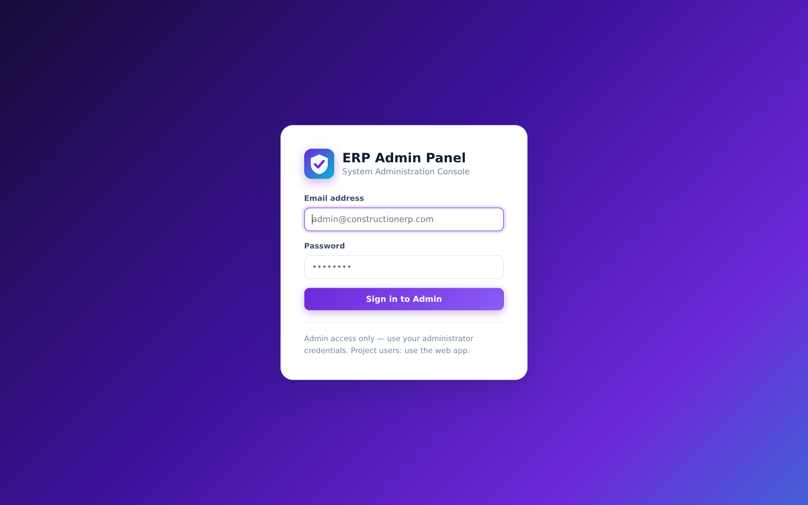
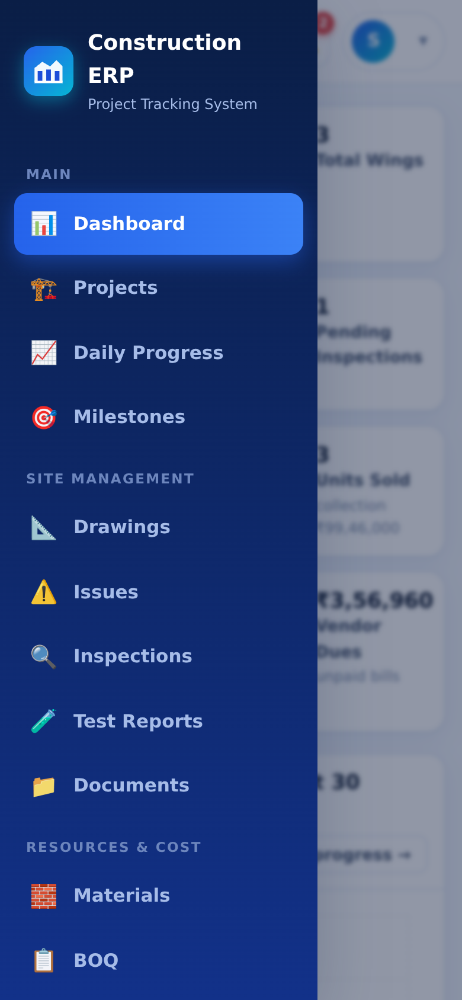
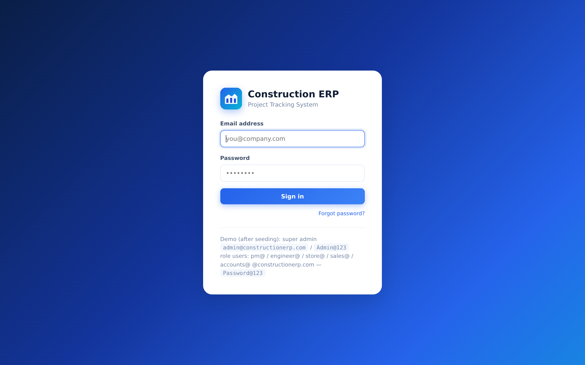
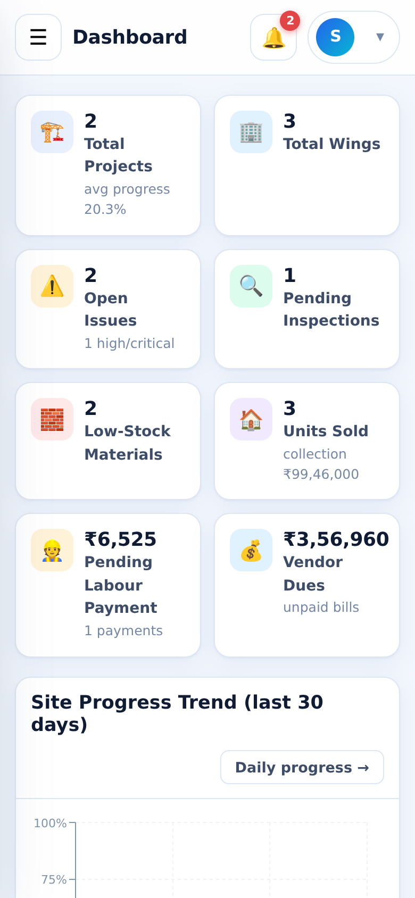
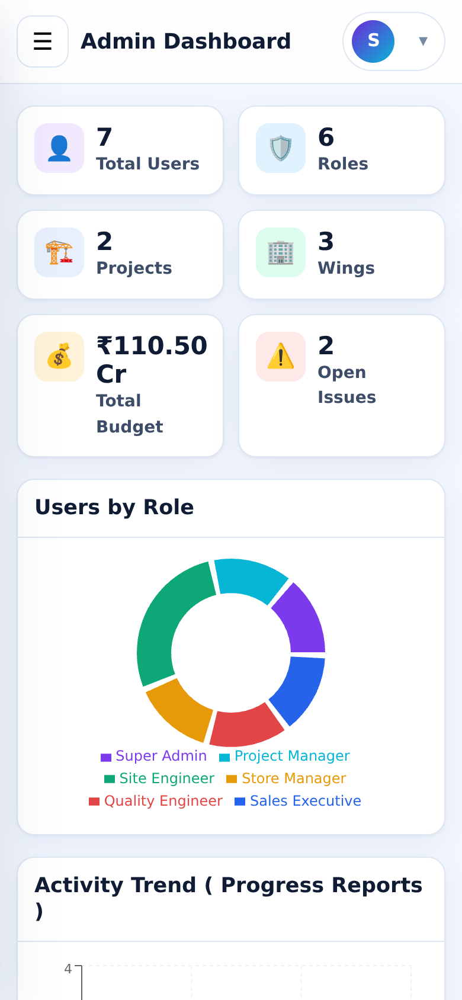
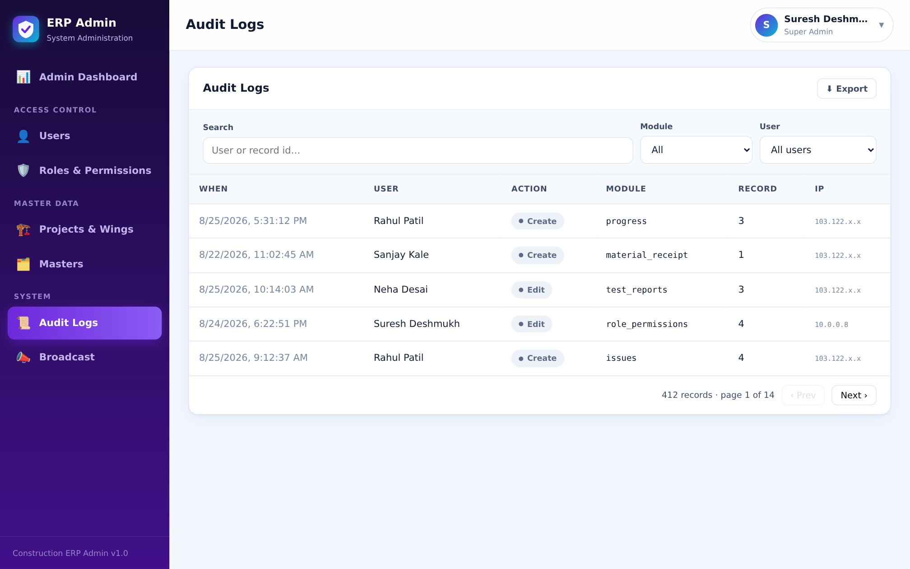
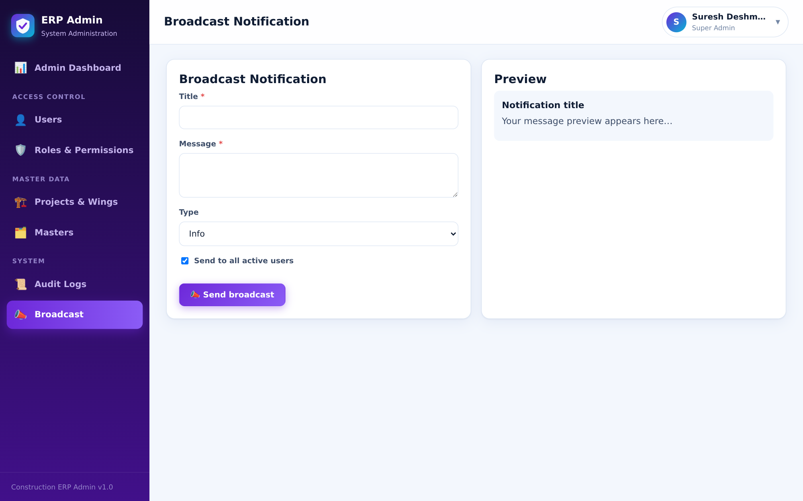

# Construction ERP — User Manual

**Version 1.0** · Covers the Web Portal, Admin Panel and Mobile App

---

## Contents

1. [About the system](#1-about-the-system)
2. [Roles and who does what](#2-roles-and-who-does-what)
3. [Getting access & first login](#3-getting-access--first-login)
4. [The project flow — step by step](#4-the-project-flow--step-by-step)
5. [Web Portal — screen guide](#5-web-portal--screen-guide)
6. [Admin Panel — screen guide](#6-admin-panel--screen-guide)
7. [Mobile App — screen guide](#7-mobile-app--screen-guide)
8. [A day in the life, by role](#8-a-day-in-the-life-by-role)
9. [Status & workflow reference](#9-status--workflow-reference)
10. [Tips, FAQ & troubleshooting](#10-tips-faq--troubleshooting)

---

## 1. About the system

Construction ERP tracks everything that happens on a construction site — from daily progress photos and worker attendance to materials, quality checks, costs and unit sales — in one place. It has three user-facing applications plus a backend:

| App | Who uses it | Where |
|---|---|---|
| **Web Portal** (`web-app`) | Project managers, engineers (civil/electrical/plumbing), store manager, sales team, accountants, safety & quality officers | Browser — laptop, tablet or phone |
| **Admin Panel** (`admin-panel`) | Super Admin / Admin | Browser |
| **Mobile App** (`mobile`) | Site engineers & site staff on the field | Android / iOS via Expo Go or a store build |

Key ideas to know before you start:

- **Structure** — every project is broken into **Projects → Wings/Blocks/Towers → Floors → Units**. Progress rolls up automatically (floor % → wing % → project %).
- **Permissions** — you only see the modules your role allows, and only the **projects/wings you are assigned to**. Buttons for actions you're not allowed to do are hidden (and blocked server-side anyway).
- **Offline-first mobile capture** — progress reports and issues can be saved without network; they sync automatically later, without duplicates.
- **Everything is audited** — every create/edit/delete records who did it, when, and what changed.

---

## 2. Roles and who does what

The system ships with 12 ready-made roles. Admins can also create **custom roles** with any permission mix (see §6.3).

| Role | What they do daily |
|---|---|
| **Super Admin** | Full control: users, roles, all projects, all data, admin panel. |
| **Admin** | Same as Super Admin except cannot manage roles' permission matrix internals. |
| **Project Manager (PM)** | Owns their projects: structure, plans, milestones, approvals (requirements, BOQ), all reports, issues, billing, workforce. |
| **Site Engineer** | Daily progress reports with GPS photos, attendance marking, issues, inspections, material consumption entries — only on assigned projects/wings. |
| **Civil / Electrical / Plumbing Engineer** | Same as Site Engineer, scoped to their discipline's projects/wings (demo accounts are wing-scoped as examples). |
| **Store Manager** | Materials master, requirements → PO → GRN → stock, suppliers, consumption validation, low-stock alerts. |
| **Quality Engineer** | Test reports (upload lab results, approve/reject), inspections with checklists. |
| **Safety Officer** | Inspections, safety issues, documents. |
| **Sales Executive** | Unit sales, booking-to-payment tracking, collections. |
| **Accountant** | Billing & cost entries, vendor payments, labour payments, sales payments, financial reports. |
| **Custom roles** | Anything you define — e.g. "Contractor (view-only)", "Client (view-only)", "Surveyor". |

**8 permission actions** per module: `view · create · edit · delete · approve · export · upload · download`.

---

## 3. Getting access & first login

### 3.1 Log in

1. Open the **Web Portal** URL (e.g. `http://your-server:5173`) — mobile app: open the app.
2. Enter your **email** and **password**, press **Sign in**.
3. First time? Your admin will share your credentials. The seeded super admin is `admin@constructionerp.com` / `Admin@123` (change it immediately in production).

> **Forgot password** — tap **Forgot password?** on the login screen, enter your email, and use the reset link (valid 30 minutes) to set a new one on the Reset Password page.

### 3.2 Set up your profile

Top-right user chip → **My Profile**:

- Update name, phone, profile details.
- **Change password** — enter current password, then the new one. Active sessions are revoked on password change.

### 3.3 The shell (web)

| Area | Purpose |
|---|---|
| **Sidebar** (left) | Module navigation, grouped: Main · Site Management · Resources & Cost · Insights. On phones it's hidden — tap **☰**; it slides in over a dimmed backdrop. |
| **Top bar** | Page title, **🔔 notifications** bell (unread count badge, tap to open latest, "Mark all read"), and your **user menu** (profile / logout). |
| **Content** | Cards, tables, filters. Tables scroll sideways on small screens; every list has column filters, search and pagination. |

---

## 4. The project flow — step by step

This is the complete lifecycle of a project in the system, end to end. Each step names **who** does it and **where** (Web / Admin / Mobile).

---

### Phase 0 — Foundation setup *(Super Admin / Admin · Admin Panel)*

1. **Create the users** — Admin Panel → **Users** → **+ New User**: name, email, employee code, phone, initial password.
2. **Assign roles** — in the same user dialog, toggle roles (e.g. "Site Engineer"). Multiple roles are allowed.
3. **Create the project** — Web Portal → **Projects** → **+ New Project**: name, code, client, city/address, type, **budget**, start/target dates. (PM can also do this.)
4. **Grant project access** — Admin Panel → **Users** → edit user → **Project Access**: add project, optionally restricted to one **wing**. Users only see what's assigned to them *(Super Admin/Admin/PM see their managed projects)*.
5. **Review master data** — Admin Panel → **Masters**: check material categories, worker categories, labour rates, contractors, BOQ categories, test types, inspection types, issue categories, notification settings. Add your own — these feed every dropdown in the system.

### Phase 1 — Build the project structure *(PM / Site Engineer · Web Portal)*

1. Open **Projects** → click your project → **Structure** tab.
2. **Add Wings/Blocks/Towers** — e.g. "Wing A", code `A`.
3. Select a wing → **add Floors** — e.g. "Floor 1"… (with sequence numbers).
4. Select a floor → **add Units** — unit number (e.g. `A101`), carpet area (sq.ft), price. Units drive the Sales module.
5. Switch to the **Wings** tab to track wing status (planning → in_progress → completed) as work proceeds.

### Phase 2 — Plan *(PM · Web Portal)*

1. **Milestones** — create the big checkpoints ("Foundation complete", "7th slab", "MEP first fix") with start/target dates and a responsible person. Progress % updates automatically flip milestones to *delayed* if the target date passes.
2. *(Optional)* **BOQ** — open **BOQ** → **+ New BOQ**, add line items (work description, unit, estimated quantity, rate). The system computes **estimated amount = qty × rate** and later compares actuals for variance %. You can also **import a whole BOQ from CSV/Excel paste** and **export** templates.
3. *(Optional)* **Drawings** — upload the first issue of drawings (PDF/JPG/PNG) with drawing number and discipline.

### Phase 3 — Daily site execution *(Site Engineers · Mobile App or Web)*

Every day on site:

1. **Mark attendance** — Mobile → **Attendance**: pick project/wing/date, tap each worker → *Present / Absent / Leave / Half-day*, add OT hours where needed → **Save**. Daily wage and overtime cost are computed automatically.
2. **Capture daily progress** — Mobile → **Progress** → **＋**: take **photos** (the app attaches **GPS coordinates + timestamp**), describe work done, enter %, labour count, materials used → **Submit**. Works fully **offline** — entries queue and sync when the network is back (no duplicates). Web users can do the same at **Daily Progress → + New Report**.
3. **Raise issues immediately** — anything unsafe, blocking or defective: Mobile/Web **Issues** → **＋**: photo(s) + GPS, title, category, priority (low→critical), due date, optionally assign to a teammate. The assignee gets a **notification**.
4. **Record material consumption** — Web → **Materials → Consumption** → **+ New**: material, quantity, wing/floor, location. Stock is checked live — you can't consume more than available.

### Phase 4 — Materials cycle *(Store Manager / PM · Web Portal)*

1. **Requirement raised** — Materials → **Requirements** → **+ New**: material, quantity, needed-by date, remarks. PM sees and **approves/rejects** it.
2. **Purchase Order** — **Purchase Orders** → **+ New PO**: supplier, line items (material × qty × rate), tax %, discount %. Totals (subtotal + tax − discount → **grand total**) are calculated automatically. Status moves: *draft → sent → partially_received → completed*.
3. **Goods Receipt (GRN)** — when material arrives: **Receipts (GRN)** → **+ New**: pick the PO, enter received & **damaged** quantities per item. Accepted quantity enters stock; damaged is recorded separately.
4. **Stock & alerts** — **Stock & Alerts** tab shows live stock per material from all movements (opening + receipts − consumption − damage − returns). Anything at/below its **minimum level** shows in the low-stock alert list and on the dashboard.
5. **Returns** — **Consumption** overflow or damaged stock → record a **Material Return**; once approved it posts to the ledger.

### Phase 5 — Quality gates *(Quality Engineer / Safety · Web + Mobile)*

1. **Material tests** — Quality → **Test Reports** → **+ New**: test type (cube strength, steel tensile…), material, sample/test dates, laboratory, result values, upload the lab report PDF. Mark **pass/fail**; approvers can review and confirm.
2. **Stage inspections** — Quality → **Inspections** → **+ New** (or Mobile → **Inspections**): inspection type (pre-slab checklist, rebar check, waterproofing…), project/wing/floor/location, date, and **check each checklist item pass / fail / N/A** with remarks. Attach photos + GPS. Failed inspections go to *reinspection_required*.
3. Issues found during inspections are raised as **Issues** and tracked to closure.

### Phase 6 — Workforce money *(Accountant · Web Portal)*

1. **Generate labour payments** — Workforce → **Payments** → **Generate from Attendance**: pick worker + period; the system computes payable = Σ daily amounts + OT from attendance registers, you add deductions/adjustments → create the payment record.
2. **Track & pay** — payments show *pending/partial/paid*; record paid amount, date, mode and reference when disbursed.

### Phase 7 — Billing & cost control *(Accountant / PM/ · Web Portal)*

1. **Book costs** — **Billing** → **+ New Cost Entry**: category (labour/material/equipment/…) , vendor, invoice no., amount + tax, paid amount. Status tracks *unpaid/partial/paid*.
2. **Watch budget vs actual** — the dashboard cards and the **Budget vs Actual** report compare the project budget with cumulative cost live.

### Phase 8 — Sales & collections *(Sales Team · Web Portal)*

1. **Sell a unit** — **Sales** → **+ New Sale**: project → wing → floor → **unit** (only available units list), customer name/phone, booking & sale dates, sale amount, GST. Unit status flips to *sold/booked* and disappears from availability.
2. **Record payments** — open the sale → **Add Payment**: amount, date, mode, reference. Status flows *pending → partially_paid → paid* (overdue shows if the schedule passes).
3. **Collections view** — sales summary cards: sold units, value, received, pending; the **Pending Collections** report lists what to chase.

### Phase 9 — Track, report, close *(Everyone)*

1. **Dashboard** every morning: KPIs (projects, progress %, open issues, low stock, today's attendance), 30-day progress trend, budget vs actual, pending approvals.
2. **Reports** module: 16 ready reports — project/daily progress, milestones, stock, consumption, POs, billing, BOQ, test reports, inspections, issues, attendance, sales, budget-vs-actual, pending collections, labour payments — view on screen or **download CSV**, date-filter and print.
3. **Close out** — mark milestones completed, close issues, finish drawings revisions, complete POs; set wings then project status to **completed**.

---

## 5. Web Portal — screen guide

### 5.1 Login / Forgot / Reset Password

Split-screen blue gradient login. Enter email + password → Sign in. **Forgot password** sends a reset link; **Reset Password** sets a new password from that link.

### 5.2 Dashboard

Your home: KPI cards (Projects with avg progress, Wings, Open Issues with high/critical count, Pending Inspections, Low-Stock Materials, Units Sold + collections, Pending Labour Payments, Vendor Dues), a **30-day progress trend** area chart, **Budget vs Actual** per project bars, project status donut, milestone status strip, plus lists: recent progress reports, open issues by priority, documents expiring in 30 days.

### 5.3 Projects

Filter by status/type, search. **+ New Project** (name, code, client, city, address, type, budget, dates, manager). Click a row → Project Detail:

- **Overview** — KPIs, progress bar, key facts, budget vs cost.
- **Wings** — add/edit wings with progress bars & statuses; per-wing **Wing Dashboard** shows floor progress, inspection results pie, material status, recent progress.
- **Structure** — wings → floors → units tree with add/edit/delete and unit pricing.
- **Progress** — timeline of that project's daily reports with photos.

### 5.4 Daily Progress

All reports, newest first: date, project/wing/floor, description, %, labour, weather, GPS **map links**, photo thumbnails (authenticated image viewer). **+ New Report**: pick project (wing/floor cascade), date/time, work description, % completed, labour count, materials used, weather, remarks, attach photos — each photo keeps latitude/longitude/timestamp/uploader. Web page also keeps an **offline queue** (saved in the browser) if the network drops. Export CSV available.

### 5.5 Milestones

Table by project with target dates, % complete, status (pending/in_progress/completed/delayed — auto-flips to delayed past target date). **+ New Milestone**: project, optional wing, name, dates, responsible user, %.

### 5.6 Drawings

Drawing register: number, title, discipline, project/wing, current revision, status. Upload new drawings (PDF/JPG/PNG). Open a drawing → **revision history** — add a revision, **Approve / Reject** revisions, preview the file in-browser.

### 5.7 Materials (7 tabs)

- **Materials** — master list (name, code, category, unit, min stock). CRUD + CSV export.
- **Stock & Alerts** — live stock per project from the stock-transaction ledger; low-stock alerts; full transaction history (receipt/consumption/damage/return).
- **Requirements** — requirement requests with PM **Approve/Reject** workflow (status: pending → approved → po_created / rejected).
- **Purchase Orders** — PO list + create with multi-line items, tax/discount, auto totals; open a PO for status transitions and to record receipts.
- **Receipts (GRN)** — receipts against POs with received/damaged quantities (posts stock transactions).
- **Consumption** — material consumed at wing/floor with live stock validation.
- **Suppliers** — supplier master with contact & GST details, CRUD + export.

### 5.8 BOQ

BOQ list per project (title, items count, estimated vs actual). **+ New BOQ**, or open one → detail: totals card (estimated total, actual total, cost variance %), items table with **qty × rate**, actual qty, **qty variance and cost variance** columns, add/edit items, **CSV template export + bulk import (paste CSV)**, export whole BOQ.

### 5.9 Billing & Cost

Stat cards (Total cost / Paid / Pending), stacked monthly cost chart, cost entries table (date, category, vendor, invoice, amount, tax, paid, status). **+ New Cost Entry** — 20 fields incl. project/wing, category, vendor/supplier, amounts; payment status computes automatically from paid vs total.

### 5.10 Quality

- **Test Reports** — table (test no., type, project, material, dates, lab, result **pending/pass/fail**, report file view). Filters by type/result; approve/reject actions for authorized users.
- **Inspections** — list + create: type, project/wing/floor/location, date, observation, **checklist builder** (add items inline, each pass/fail/N/A + remarks), photos + GPS, status workflow pending → passed/failed/reinspection_required → closed.

### 5.11 Issues

Filters (status, priority, category, project). **+ New Issue** — title, category, priority, project/wing/floor, description, photos + GPS, assignee, due date. Open an issue → **status actions** (assign, start work, resolve, close, reopen) and the **comment thread**.

### 5.12 Workforce

- **Attendance** — date + project grid of all workers; quick-mark **All Present**, per-worker P/A/L/H/OT buttons with OT hours; live day total (Σ wages + OT); **Save** writes the whole day at once.
- **Workers** — worker master (code, name, category, contractor, daily wage, OT rate, phone).
- **Payments** — labour payment records; **Generate from Attendance** (worker + period → auto-computed payable), adjust deductions, record paid amounts/mode/reference; statuses pending → partial → paid; monthly register view.

### 5.13 Sales

Stat cards (units sold, sale value, received, pending). Sales table with status. **+ New Sale** — cascading **Project→Wing→Floor→Unit (only available units)**, customer details, dates, amount, GST. Row → **payments**: full payment history + **Add Payment**.

### 5.14 Documents

Document register: title, category (contract, insurance, license…), project, **expiry date** (expiring-soon highlighted and shown on the dashboard). Upload (PDF/JPG/PNG/DOC/XLS), download, delete, filter by category/project.

### 5.15 Reports

16 report cards: pick one → viewer with date/project filters, on-screen table, **Download CSV**, print. Reports: Project Progress, Daily Progress, Milestones, Material Stock, Material Consumption, Purchase Orders, Billing & Cost, BOQ Summary, Test Reports, Inspection Reports, Issues, Worker Attendance, Sales, Budget vs Actual, Pending Collections, Labour Payments.

### 5.16 My Profile

Edit name/phone, change password; see your roles and project access.

---

## 6. Admin Panel — screen guide

### 6.1 Admin Dashboard

Users by role donut, activity trend, total users/projects/roles/audit count cards, recent audit log table, role list with user counts.

### 6.2 Users

All users (search, filter by status/role). **+ New User** (account details). Row actions: **Edit**, **Roles** (toggle role chips), **Project Access** (rows of project + optional wing restriction — this is how wing-scoped engineers are configured), **Reset Password** (set a new password directly), **Enable/Disable**, **Delete**. Export users to CSV.

### 6.3 Roles & Permission Matrix

Role list with user & permission counts. **+ New Role** for custom roles. Click **Permissions** on a role → the **matrix editor**: every module (projects, progress, materials, …) × 8 actions (view/create/edit/delete/approve/export/upload/download) with checkboxes, module-level toggle, live selected count → **Save**.

### 6.4 Masters

Nine master-data tabs feeding all dropdowns: **Material Categories, Worker Categories, Labour Rates, Contractors, BOQ Categories, Test Types, Inspection Types, Issue Categories, Notification Settings** (enable/disable per event like `issue_assigned`, `low_stock`, `document_expiring`). Full CRUD with activate/deactivate.

### 6.5 Projects Overview

Read-only bird's-eye: all projects, expand a row → its wings → floors with progress — a quick audit of structures without edit rights.

### 6.6 Audit Logs

Complete trail: user, action (create/edit/delete/login…), module, record, **old vs new values (JSON diff view)**, IP, timestamp. Filter by user/module/action/date; export CSV.

### 6.7 Broadcast

Compose an in-app + push message: title, body, type. Target **all users**, a role, or hand-picked users (multi-select). Preview before sending.

---

## 7. Mobile App — screen guide

> Screenshots: run the app through Expo Go on your phone (see §3.1 of the README) and take captures on-device — the web portal captures in §5 also show how every screen adapts to phone widths.

The mobile app mirrors the essentials for site work. Bottom tabs: **Home · Progress · Attendance · Issues · More** (More shows an orange badge when offline items are queued).

### 7.1 Login
Brand screen → email + password → **Sign In**. Stays signed in (secure token storage, automatic refresh).

### 7.2 Home (Dashboard)
Greeting + date, stat tiles (projects, avg progress, open issues, pending inspections, low stock, today's attendance), quick-action shortcuts, recent progress & open-issue cards. Tap notifications 🔔 to see the latest.

### 7.3 Progress — list
Project filter chips → report cards (date, %, description, wing/floor, photo count, GPS indicator). Tap a card → **Progress Detail** (full report + photo grid with per-photo GPS/time, map links).

### 7.4 Progress — capture ("+ New Report")
The flagship screen:
1. **Pick project** (wing/floor optional), date/time auto-filled.
2. **Take photos** with the camera (or attach from gallery) — thumbnails show in a strip; each photo stores **GPS position + capture time**.
3. Fill work description, % complete, labour count, material used, weather, remarks.
4. **Submit** — uploads photos + metadata; if offline, it saves to the **Sync Queue** instead (duplicate-protected by a client reference).

### 7.5 Attendance
Date (default today) + project/wing → the worker list; quick-mark icons: **P / A / L / H / OT** per worker, OT hours stepper; header shows running day cost; **Mark all present** button; **Save** posts the entire grid in one call (idempotent re-saves allowed for corrections).

### 7.6 Issues
List with status/priority filters. **＋ Raise Issue**: camera photos + GPS, title, category, priority, location notes, assign to a teammate, due date — works offline too and queues. Detail screen: status timeline, actions (assign/start/resolve/close/reopen) and comments with author/time.

### 7.7 Inspections
Under **More → Inspections**: list; open one → the checklist: tap **pass/fail/N/A** per item + remarks, add notes, and submit status — inspection updates sync to the same backend tables as the web portal.

### 7.8 More
- **Offline Sync** — queue of pending progress/issues with per-item status; **Sync now** retries immediately; auto-sync runs when connectivity returns.
- **Notifications** — full notification list (assignments, approvals, alerts).
- **Profile & sync status**, app info, **Logout**.

Push notifications: on first login the app asks permission and registers your device — you then receive push alerts (issue assignments, approvals, broadcasts).

---

## 8. A day in the life, by role

**Site Engineer** — 8:30 AM mark attendance (mobile) → through the day: raise issues as spotted (photo), consume materials (web/app) → 5:30 PM submit daily progress with photos + % → check Sync queue shows 0 pending.

**Project Manager** — Morning dashboard (issues, low stock, attendance) → approve material requirements & BOQ changes → review yesterday's progress % per wing → update milestones, weekly reports to management (CSV export).

**Store Manager** — Check **Stock & Alerts** → run low-stock list → create requirements → convert approved ones to POs → record GRNs on delivery → reconcile consumption entries.

**Quality Engineer** — Book today's inspection (checklist on mobile) → upload lab test report PDFs with results → approve/reject pending test reports → raise issues from failures.

**Accountant** — Book vendor invoices in Billing → generate labour payments from attendance → record sales receipts in Sales → export Pending Collections + Budget vs Actual for the review meeting.

**Admin** — Add new joiners & assign roles/project access → check Audit logs → broadcast safety notices.

---

## 9. Status & workflow reference

| Entity | Statuses |
|---|---|
| Project | planning → in_progress → on_hold / completed / cancelled |
| Wing/Floor | planning → in_progress → completed |
| Milestone | pending → in_progress → completed (auto **delayed** past target) |
| Requirement | pending → approved → po_created (or rejected) |
| Purchase Order | draft → sent → partially_received → completed (or cancelled) |
| Test Report | pending → pass / fail / inconclusive |
| Inspection | pending → passed / failed / reinspection_required → closed |
| Issue | open → assigned → in_progress → resolved → closed (reopened anytime) — priorities low/medium/high/critical |
| Attendance | present / absent / leave / half_day / overtime |
| Labour payment | pending → partial → paid |
| Cost entry | unpaid → partial → paid |
| Sale | pending → partially_paid → paid (overdue) |
| Sale unit | available → booked → sold |
| Document | active → expiring (30-day watch) → expired |

**Photo/file formats:** JPG, JPEG, PNG, WEBP, PDF, XLS, XLSX, DOC, DOCX (max 20 MB per file by default). **Every uploaded file requires login + project access** to view.

---

## 10. Tips, FAQ & troubleshooting

**Tips**
- Attach photos **at the site** — GPS is captured automatically, giving you tamper-proof location+tamper evidence.
- Use the web portal's filter bars — almost every list filters by project, wing, date range and status before CSV export, so exports are already sliced.
- Can't find a menu item? It's permission-related — ask your admin to check your role in the **permission matrix**.
- Assign engineers to specific **wings** for large projects to keep lists short and access tight.

**FAQ**
- *I submitted progress twice by mistake* — offline sync uses a client reference, so retries never duplicate; if you created two by hand on web, delete one (editors with delete permission).
- *Why can't I consume material?* — stock is validated live; add a GRN first or reduce the quantity.
- *Why did my milestone turn "delayed"?* — target date passed while status wasn't completed; update the % or the target date.
- *Push notifications not arriving?* — allow notifications when the app asks (or in phone settings), and confirm you're logged in; tokens register on login.
- *GPS shows "unavailable"* — grant the app Location permission (and camera permission for photos) when asked.

**Troubleshooting**
- *Login fails with "Invalid credentials"* — verify caps lock; use **Forgot password**; admin can also reset it from Admin Panel → Users.
- *"Network error" on mobile at site* — the app works offline: finish entries; they'll sync when you reconnect. For full features, the API server must be reachable at the configured address.
- *Photo won't upload (>20 MB)* — retake at normal resolution or compress; the limit protects site bandwidth.

---

*For installation, see `docs/INSTALLATION.md` · for the API, `docs/API.md` · for deployment, `docs/DEPLOYMENT.md`.*
