# Construction ERP — Complete User Manual

| | |
|---|---|
| **Document** | User Manual — complete screen guide with full data flow |
| **Version** | 2.0 (supersedes 1.0) |
| **Product** | BuildTrack — Construction Project Tracking · v1.0 |
| **Covers** | Web Portal (`web-app`), Admin Console (`admin-panel`), Mobile App (`mobile`), Marketing site, Backend API & MySQL data model |
| **Last updated** | 18 September 2026 |

## Contents

1. System overview
2. Roles, permissions & access control
3. Logging in & account basics
4. Web Portal — complete screen & tab guide
5. Admin Console — complete screen & tab guide
6. Mobile App — screen guide
7. End-to-end data flows (complete)
8. Data dictionary — all database tables
9. Status & workflow reference
10. Tips, FAQ & troubleshooting

**How to read this manual.** Every screen section follows the same pattern: what the screen is for, how to operate it step by step, and a **Data flow** table tracing each user action from the UI, through the REST API endpoint, to the exact MySQL tables written or read, including side effects (notifications, stock updates, status changes, audit entries). Chapter 7 combines these into the complete cross-module data flows a site team actually runs day to day.

---

## 1. System overview

Construction ERP is a complete project-tracking platform for construction companies. It is built from five deployable applications that all talk to one backend and one MySQL database:

| App | Stack | Who uses it | Purpose |
|---|---|---|---|
| **Backend API** (`backend/`) | Node.js 18+, Express, raw `mysql2` (no ORM) | — | REST API: JWT auth, RBAC, project/wing scoping, file uploads, audit trail, 65-table schema |
| **Web Portal** (`web-app/`) | React 18 + Vite + TypeScript | PMs, engineers, store, sales, accounts, quality & safety | Day-to-day project work: progress, workforce, materials, BOQ, quality, HR & payroll, petty cash, sales, reports |
| **Admin Console** (`admin-panel/`) | React 18 + Vite + TypeScript | Super Admin / Admin | Users & employees, roles & permission matrix, master data, audit logs, broadcasts |
| **Mobile App** (`mobile/`) | React Native + Expo SDK 54 | Site engineers & field staff | Offline-first daily progress with camera + GPS, attendance, issues, inspections, sync queue, push notifications |
| **Marketing site** (`marketing/`) | React 18 + Vite + TypeScript | Visitors | Public landing page describing the ERP's actual capabilities |

### 1.1 Key concepts you must know first

- **Project structure.** Every project is organised as **Projects → Wings/Blocks → Floors → Units**. This hierarchy drives progress roll-up, access scoping and reporting.
- **Automatic progress roll-up.** When a daily progress report is saved, the server recomputes: **wing progress** = average of all `daily_progress.percentage` rows for that wing; **project overall progress** = average of its wings' progress. You never type project % by hand.
- **Role-based access (RBAC).** Every module has up to 8 permission actions: `view · create · edit · delete · approve · export · upload · download`. Roles bundle permissions; users get roles. The UI hides menu items and buttons you cannot use — and the API re-checks every single request.
- **Project & wing scoping.** Beyond module permissions, each user is assigned specific **projects (and optionally wings)** in `user_projects`. Scoped users only see and act on their own projects. A row with `wing_id = 0` means "all wings of that project". Super Admin and the Admin role are global.
- **One shared employee directory.** The Admin Console and the Web Portal read and write the **same** `hrms_employees` records. A login account and its employee record represent the same person, linked by `hrms_employees.user_id`. You can create either side and offer to create/link the other; the link is one-to-one and never bypasses RBAC.
- **Everything is audited.** Every create / update / delete / export writes a row to `audit_logs` with who, when, which module and record, the IP, and the full old/new JSON values.
- **Event-driven notifications.** Assignments, approvals, rejections, low stock, overdue issues, failing tests, expiring documents and pending collections raise in-app notifications (and Expo push on mobile). Every event can be switched off in Admin → Masters → Notification Events.
- **Offline-first mobile.** The mobile app queues progress reports and issues locally (with a unique `client_ref`) when there is no network and auto-syncs in the background. The server de-duplicates by `client_ref`, so re-syncing never creates double entries.

### 1.2 Architecture & data flow (big picture)

```
┌──────────────────────┐   ┌──────────────────────┐   ┌──────────────────────┐
│  Web Portal (React)  │   │ Admin Console (React)│   │ Mobile (Expo, offline│
│  localhost:5173 dev  │   │  localhost:5174 dev  │   │  queue + Expo push)  │
└──────────┬───────────┘   └──────────┬───────────┘   └──────────┬───────────┘
           │  HTTPS /api (JWT Bearer) │  HTTPS /api (JWT Bearer) │ HTTPS /api
           ▼                          ▼                          ▼
┌───────────────────────────────────────────────────────────────────────────────┐
│                        BACKEND  ·  Express REST API :4000                     │
│  authenticate (JWT access 15min + rotating refresh)  →  attachProjectScope    │
│  requirePermission(module.action)   →  controller   →  raw SQL (mysql2)       │
│  side effects: audit_logs · notifications · stock_transactions · roll-up      │
└──────────────────────────────────────┬────────────────────────────────────────┘
                                       ▼
                 ┌──────────────────────────────────────────┐
                 │      MySQL 8 · 65 tables + files on disk │
                 │  identity · projects · materials · HRMS  │
                 │  quality · sales · finance · audit       │
                 └──────────────────────────────────────────┘
```

Data-flow rule of thumb for every screen in this manual:

**UI action → one REST call → controller validates (permission + project scope) → transactional SQL writes the business tables → side effects (stock ledger, progress roll-up, notifications, audit row) → JSON response → UI refreshes.**

---

## 2. Roles, permissions & access control

### 2.1 Permission model

- A **permission** is a code `module.action`, e.g. `materials.approve`, `hrms.create`, `attendance.export`.
- A **role** is a named set of permission ids (`role_permissions` join table).
- A **user** has one or more **roles** (`user_roles`) and an optional list of **project/wing assignments** (`user_projects`).
- The **Super Admin** role (`super_admin`) bypasses every check. The **Admin** role (`admin`) is global across projects.
- All other users must hold the specific `module.action` permission **and** be inside their project/wing scope for any record-level operation.

Permission codes are managed centrally (Admin Console → Roles → Permissions matrix); custom roles can be created at any time from any combination of checkboxes.

### 2.2 Seeded roles

The installer seeds 12 ready-made roles. Admins can create further **custom** roles.

| Role (code) | Typical daily work |
|---|---|
| Super Admin (`super_admin`) | Full unrestricted access to both apps, all data, role matrix |
| Admin (`admin`) | System administration: users, masters, audit, broadcasts (global project visibility) |
| Project Manager (`project_manager`) | Owns assigned projects: structure, milestones, approvals (requirements, POs, BOQ), reports, billing, workforce |
| Site Engineer (`site_engineer`) | Daily progress with GPS photos, attendance, issues, inspections, consumption — on assigned projects/wings |
| Civil / Electrical / Plumbing Engineer (`civil_engineer`, `electrical_engineer`, `plumbing_engineer`) | Same as Site Engineer, scoped to their discipline (demo accounts are wing-scoped to demonstrate scoping) |
| Sales Executive (`sales_executive`) | Unit sales, booking-to-payment tracking, collections, sales export |
| Store Manager (`store_manager`) | Material master, requirement → PO → GRN → stock, suppliers, returns, low-stock follow-up |
| Accountant (`accountant`) | Cost/billing entries, vendor dues, labour payments, payroll payments, financial reports |
| Safety Officer (`safety_officer`) | Safety inspections, safety issues, documents |
| Quality Engineer (`quality_engineer`) | Material test reports (approve/reject), inspection checklists |
| Custom roles | Anything you build — e.g. "Contractor (view-only)", "Client (view-only)", "Surveyor" |

### 2.3 Demo logins (after `npm run db:setup`)

All demo accounts exist in the seeded database. **Change all passwords before any real deployment.**

| Role | Email | Password |
|---|---|---|
| Super Admin | admin@constructionerp.com | Admin@123 |
| Admin (Console) | admin.user@constructionerp.com | Password@123 |
| Project Manager | pm@constructionerp.com | Password@123 |
| Site Engineer | engineer@constructionerp.com | Password@123 |
| Civil / Electrical / Plumbing Engineer | civil@ / electrical@ / plumbing@constructionerp.com | Password@123 |
| Sales Executive | sales@constructionerp.com | Password@123 |
| Store Manager | store@constructionerp.com | Password@123 |
| Accountant | accounts@constructionerp.com | Password@123 |
| Safety Officer | safety@constructionerp.com | Password@123 |
| Quality Engineer | quality@constructionerp.com | Password@123 |

### 2.4 How access control appears in the UI

- **Web Portal sidebar** items and **Admin Console** menu items are filtered by `canAny(perm)` — if your roles have none of the required permission for a module, the menu entry simply does not exist.
- **Route guard.** Opening a URL directly without the required permission shows a "No access — contact your administrator" card.
- **Row-level buttons.** Approve / Reject / Delete / Export buttons appear only when the matching `module.action` permission is present.
- **Server-side enforcement.** Even with a tampered client, the API returns `403 Missing permission: module.action` or `403 No access to project N / wing N` from `assertProjectAccess`.
- **Data scoping.** List queries for scoped users are filtered to `user_projects`; the demo electrical & plumbing engineers only see their wing's data.
---

## 3. Logging in & account basics

### 3.1 Sign in (Web Portal and Admin Console)

Both applications use the same login flow.

1. Open the app URL. If you are not signed in you are redirected to **Login**.
2. Enter your **email** and **password** and press **Sign in**.
3. On success you land on your default screen: the Web Portal Dashboard or the Admin Console Dashboard.

**What happens behind the scene (data flow):**

| Step | UI | API | Database tables | Effect |
|---|---|---|---|---|
| 1 | Submit email + password | `POST /api/auth/login` | `users` (bcrypt hash check), `refresh_tokens` (insert hashed token), `users.last_login_at` updated | Access token (short-lived) + rotating refresh token returned; JWT carries user id, roles, permission set |
| 2 | App stores tokens, calls `/api/auth/me` | `GET /api/auth/me` | `users`, `user_roles`, `role_permissions`, `permissions`, `user_projects`, `hrms_employees` (via `user_id`) | Full profile: roles, permission codes, project/wing access, linked employee (if any) |
| 3 | Sidebar renders | — | — | Menu items filtered by permission codes |

- **Token refresh.** The API client automatically calls `POST /api/auth/refresh` when the access token expires. The old refresh token is **revoked and a new one issued** (rotation); a stolen refresh token can therefore only be used once.
- **Session revocation.** Logging out (`POST /api/auth/logout`) or an admin resetting your password revokes all of your refresh tokens immediately — every device is signed out.
- **Rate limiting.** Login endpoints are rate-limited to block credential brute force.

### 3.2 Forgot password

1. On the login screen click **Forgot password?**.
2. Enter your email and submit. If the account exists, the server creates a **password reset token** (single-use, time-limited) and an email link is produced by the mail pipeline configured in `backend/.env`.
3. Open the link, enter a new password (min 8 characters) on the **Reset password** screen, submit — you are back at login, and all previous sessions are revoked.

| Step | UI | API | Database tables |
|---|---|---|---|
| Request | Email form | `POST /api/auth/forgot-password` | `password_reset_tokens` (new token row) |
| Reset | New password form | `POST /api/auth/reset-password` | `users.password` updated, `password_reset_tokens` consumed, `refresh_tokens` for the user revoked |

### 3.3 My Profile (Web Portal)

Open the user chip (top right) → **My Profile**.

- **Left card — profile.** Shows avatar, name, email, employee code (if linked), role badges and **SUPER ADMIN** badge when applicable. You can edit **Full name** and **Phone** (saved via `PUT /api/auth/profile` → `users`).
  - **HR & Payroll profile block** (only when your login is linked to an employee): employee code, department, effective designation, employment type, project, status. Changes made by HR on the employee record appear here automatically.
  - **Project Access list:** every project (and wing, if wing-scoped) you are assigned to; Super Admins with no entries see "access to all projects".
- **Right card — change password.** Current password, new password (min 8 chars), confirm. On success you are logged out and must sign in again.

| Action | API | Tables |
|---|---|---|
| Save name/phone | `PUT /api/auth/profile` | `users` |
| Change password | `POST /api/auth/change-password` | `users.password`, all `refresh_tokens` revoked |

---

## 4. Web Portal — complete screen & tab guide

The Web Portal is where construction work happens. The sidebar (left) is grouped into four work areas; every entry is permission-gated:

| Sidebar group | Menu items |
|---|---|
| Site Operations | Dashboard · Projects · Daily Progress · Workforce & Attendance · Equipment |
| Project Management | Tasks & Milestones · Drawings · Inspections · Test Reports · Documents · Issues / Snags |
| Accounts & Sales | Materials & Inventory · BOQ · Payments · Petty Cash · CRM & Sales · HR & Payroll |
| Insights | Reports & Dashboards |

### 4.0 Global chrome: top bar, search, notifications bell, user menu

- **Top bar.** Page title for the current screen, a global search field (projects, tasks, materials), the notifications bell, and the user chip (name + primary role) opening **My Profile** and **Logout**.
- **Notifications bell.** Polls `GET /api/notifications?limit=12` on open and every 60 seconds; unread count shown as a badge (capped at 99+).
  - Clicking a notification marks it read (`PUT /api/notifications/:id/read`) and **deep-links** you into the module: issues → Issues, milestones → Tasks, materials/inventory/purchase_orders → Materials (PO tab), inspections, test reports, sales, documents, drawings, hrms, petty_cash, system → home.
  - **Mark all read** via `POST /api/notifications/mark-all-read`.
  - Notification rows are tinted by type: success (green), warning (orange), error (red), info (blue).
- **User menu.** My Profile / Logout (`POST /api/auth/logout` revokes sessions).

| Action | API | Tables |
|---|---|---|
| Open bell | `GET /api/notifications?limit=12` | `notifications` (per current user, unread count) |
| Click item | `PUT /api/notifications/:id/read` | `notifications.is_read = 1` |
| Mark all | `POST /api/notifications/mark-all-read` | `notifications.is_read = 1` for all of user's rows |

### 4.1 Dashboard

The landing page gives a cross-module snapshot of everything the organisation is doing.

**Elements**

- **Hero banner** — greeting, active project count, units sold, open issues; quick buttons to Projects and a new Daily update.
- **8 KPI tiles** — Total Projects (with average progress), Total Wings, Open Issues (with high/critical count), Pending Inspections, Low-Stock Materials, Units Sold (with collections), Pending Labour Payment (amount + count), Vendor Dues (unpaid bills).
- **Charts & lists** — Site Progress Trend (avg daily progress % over last 30 days), Projects by Status (donut), Budget vs Actual Cost per project (₹ lakhs), Pending Issues list (priority + status badges), Recent Daily Updates (with %), Milestones Overview (counts by status), Sales collections callout, Documents expiring soon (top 3).
- **Module quick launch** — 10 tiles deep-linking into the core modules.

**Data flow.** One call powers the whole page:

| UI | API | Tables read (join/aggregate) |
|---|---|---|
| Entire dashboard | `GET /api/dashboard/overview` | `projects`, `wings`, `units`, `daily_progress` (30-day trend), `issues`, `inspections`, `materials` + `stock_transactions` (low stock), `sales` + `sales_payments` (sold/value/pending), `labour_payments` (pending), `cost_entries` (vendor dues), `milestones`, `project_documents` (expiring) |

Nothing on this page is editable — it is a read-only aggregate.

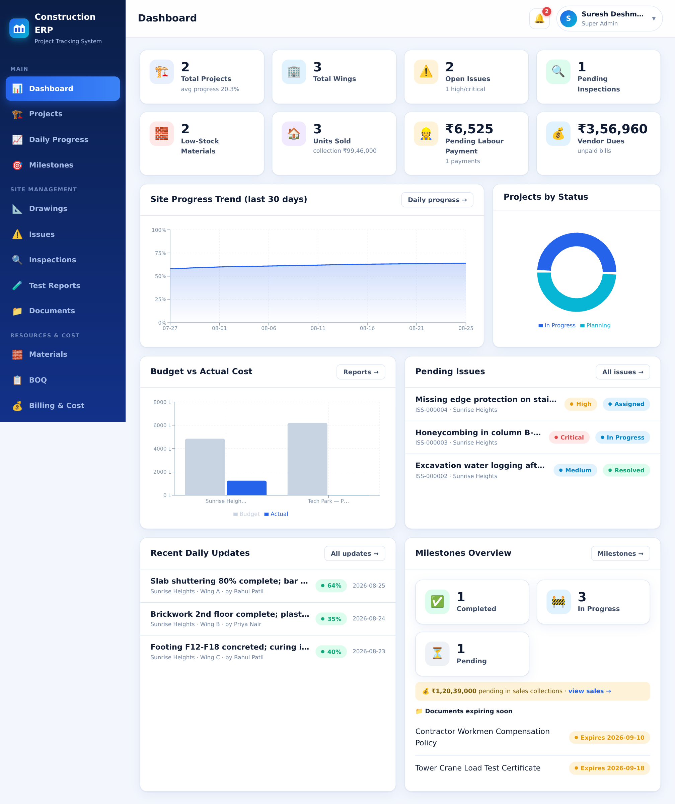

### 4.2 Projects

The register of all projects you can see (scoped users see only their assignments).

**Elements**

- **Table columns** — Code, Project (name + city/state), Type badge, Client, Manager, Wing count, Budget, Progress bar, Status badge, Expected completion.
- **Filters** — Status (planning / in_progress / on_hold / completed / cancelled), Type (residential / commercial / industrial / infrastructure / mixed / other).
- **Search** — name, code, client, city.
- **CRUD modal (New Project)** — Name, Code (auto-generated if blank), Type, Client/owner, Developer, City, State, PIN, Address, Project manager (user directory), Budget (₹), Status, Start / Expected / Actual completion dates, Description.
- **Actions** — Export CSV (when `projects.export`), Edit / Delete per row. Row click opens **Project Details** (4.3).

**Data flow**

| Action | API | Tables |
|---|---|---|
| List + search + filter | `GET /api/projects?search=&status=&project_type=&page=&limit=` | `projects` (+ `wings` count, manager name join), filtered by `user_projects` scope |
| Create | `POST /api/projects` | `projects` (code auto-generated like `PRJ-####` when blank), `audit_logs` |
| Edit | `PUT /api/projects/:id` | `projects` (old/new values captured in audit), `audit_logs` |
| Delete | `DELETE /api/projects/:id` | `projects` (blocked while child records exist — wings, progress, etc.), `audit_logs` |
| Export | `GET /api/projects/export` | same query → CSV download; `audit_logs` action=export |

**Status values:** `planning → in_progress → on_hold → completed | cancelled` (managed by the manager; "cancelled" and "completed" are terminal for reporting).

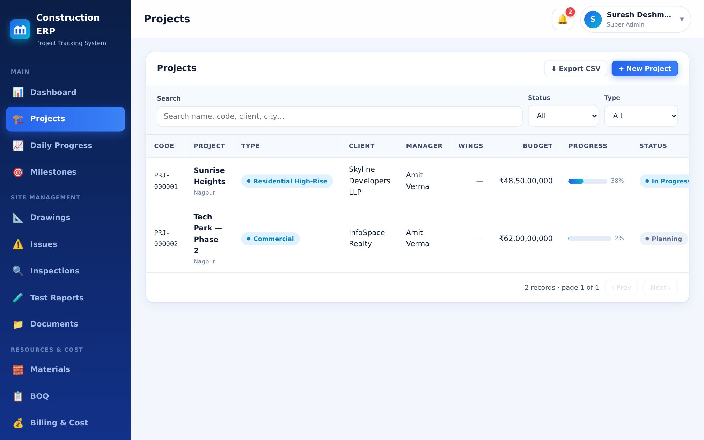

### 4.3 Project Details

Open any project row. The page has a header (name, status, type, code, client, city/state, manager, **overall progress bar** — always server-computed) and tabs:

**Tab 1 — Overview.** KPI tiles for wings/floors/units and budget, the progress roll-up summary, and the structural CRUD for this project: add **Wing**, add **Floor**, add **Unit** (unit number, wing, type, saleable area, price, status). These are the building blocks used by progress reports, sales and scoping.

**Tab 2 — Wings (n).** Wings table with per-wing progress bar, status, floor/unit counts; add/edit wing (name, code, manager, area, dates, status, progress — blank progress is auto-calculated), delete wing (with confirmation: *"Delete wing … and all its floors/units?"*).

**Tab 3 — Wing Dashboard** (appears when you deep-link to a wing, e.g. from a notification or the wings tab). KPIs: wing progress %, active issues, units sold + value, collections + pending. Plus Floor Progress list (bars per floor), Recent Updates for the wing, Inspections by Status donut, Material Status mini-table (in-stock + LOW badge for that project), Active Issues table.

**Tab 4 — Progress Timeline.** Area chart of daily average progress % per date for the project (labour and report counts in tooltip).

**Tab 5 — Floors & Units.** Wing filter, unit status summary badges (available / booked / sold counts), Floors table (wing, floor, progress bar, status) and Units table (unit no, wing, type, area sqft, price, status badge).

**Data flow**

| Action | API | Tables |
|---|---|---|
| Load project | `GET /api/projects/:id` | `projects` + nested `wings` |
| Add wing | `POST /api/wings` | `wings`, `audit_logs` |
| Edit wing | `PUT /api/wings/:id` | `wings` (blank `progress` left to roll-up), `audit_logs` |
| Delete wing | `DELETE /api/wings/:id` | `wings` + cascade of its `floors`/`units`, `audit_logs` |
| Add floor | `POST /api/floors` | `floors`, `audit_logs` |
| Edit floor | `PUT /api/floors/:id` | `floors`, `audit_logs` |
| Add unit | `POST /api/units` | `units`, `audit_logs` |
| Edit / delete unit | `PUT/DELETE /api/units/:id` | `units`, `audit_logs` (delete blocked when the unit is sold) |
| Wing dashboard | `GET /api/dashboard/wing/:wingId` | `wings`, `floors`, `daily_progress`, `issues`, `sales`+`sales_payments`, `inspections`, `stock_transactions`+`materials` |
| Progress timeline | `GET /api/progress/timeline?projectId=` | `daily_progress` grouped by date |
| Floors / units lists | `GET /api/floors?projectId=&wingId=` · `GET /api/units?projectId=&wingId=` | `floors` · `units` |

**Roll-up reminder:** whenever any `daily_progress` row for a wing changes, the server runs `recomputeProjectProgress(projectId)` inside the same transaction — wing progress = AVG(percentage) of the wing's progress rows, project `overall_progress` = average of wing progresses (capped at 100).

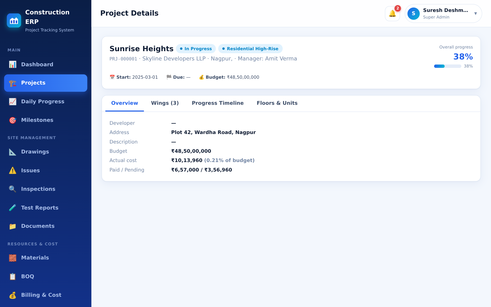
### 4.4 Daily Progress

The daily site worksheet — the heartbeat of the system. Site teams record what happened, where, with photos and GPS.

**List screen**

- **Columns** — Date, Work (description + project · wing · floor), Progress %, Labour, Photos count, GPS (link opens the coordinates on OpenStreetMap), Reported by.
- **Filters** — Project, Wing, free-text search on descriptions. Pagination (15/page).
- **Actions** — Export CSV (`progress.export`), + New Report (`progress.create`), row click → detail.

**New Report modal**

| Field | Notes |
|---|---|
| Project / Wing / Floor | Cascading selects (wing list reloads per project, floors per wing) |
| Date | Report date (required) |
| Time | Work time |
| Overall progress % | Required, 0–100 — feeds the roll-up |
| Labour count | People on site that day |
| Weather | Clear / Cloudy / Rainy / Hot / Cold |
| Work description / Work completed today | Required / optional text |
| Material used, Remarks | Free text |
| GPS | **Capture GPS** button uses the browser geolocation; coordinates are stored on the report *and* attached to every photo |
| Site photos | Up to **8** images (jpeg/png/webp). Previews show the GPS + capture date; individual removal |

**Save.** The form is submitted as `multipart/form-data` with a generated `client_ref` (`web-<timestamp>-<rand>`) and a `photosMeta` JSON array (per-photo latitude/longitude/captured_at/source). If the browser is offline the report is **queued in `localStorage` under `cerp.offlineProgress`** and the toast explains it will sync when online — the `client_ref` guarantees the server never creates it twice.

**Detail modal.** All fields, GPS link, photo grid (each photo shows source — app camera vs uploaded — and its coordinates), and Delete (`progress.delete`).

**Data flow**

| Action | API | Tables | Side effects |
|---|---|---|---|
| List | `GET /api/progress?projectId=&wingId=&search=&page=` | `daily_progress` + `projects`, `wings`, `floors`, `progress_photos` counts | Scope-filtered |
| Create | `POST /api/progress` (multipart) | `file_uploads` (each photo), `progress_photos` (progress_id, file_id, lat, lng, captured_at, source, uploaded_by), `daily_progress` (incl. `client_ref`) | **Progress roll-up** recomputed for the project; `audit_logs`; duplicate guard: if `client_ref` already exists the existing row is returned instead of a new insert |
| Edit | `PUT /api/progress/:id` | `daily_progress` | Roll-up recomputed, `audit_logs` |
| Delete | `DELETE /api/progress/:id` | `daily_progress` (+ photos) | Roll-up recomputed, `audit_logs` |
| Batch sync (mobile) | `POST /api/progress/sync` | as create, per item | Per-item result: `created` / `duplicate` / `error` |
| Export | `GET /api/progress/export` | `daily_progress` | CSV; `audit_logs` action=export |
| Photos display | `GET /api/files/:id` | `file_uploads` | Authenticated object URL (token-bounded), served from disk |

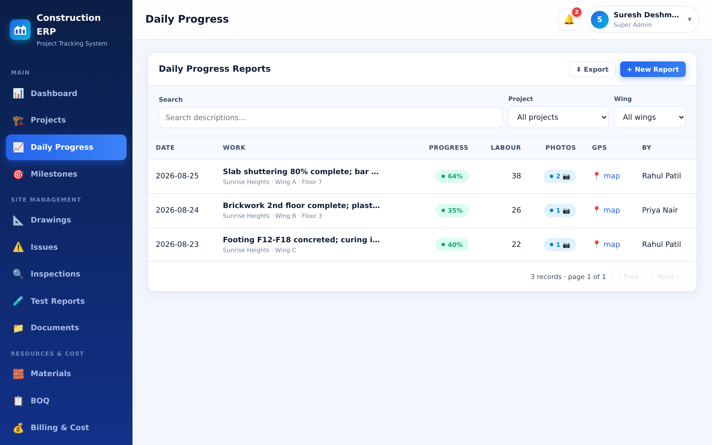

### 4.5 Workforce & Attendance

Three tabs: **Attendance** (default), **Workers**, **Labour Payments**.

**Tab: Workers** — the labour master.

- **Columns** — Code, Name, Category, Contractor, Mobile, Daily wage, OT/hr, Project, Active status.
- **Filters** — Project, Category.
- **CRUD fields** — Name, Worker code (auto if blank), Mobile, Category (from Masters → Labour Categories), Contractor (from Masters → Contractors), Daily wage (₹), Overtime rate (₹/hr), Project, Wing, Joining date, Active, ID proof.

| Action | API | Tables |
|---|---|---|
| List/create/edit/delete | `GET|POST|PUT|DELETE /api/workers…` | `workers` (+ category/contractor joins), `audit_logs` |

**Tab: Attendance** — mark a project for one day and save all workers in one batch.

1. Pick **Project** and **Date** (default today).
2. The summary badges show counts per status (present / absent / half day / leave / overtime) plus the **pay roll** badge — the day's total wage once marked.
3. Quick-mark buttons: **All present** / **All absent**.
4. Per worker: status buttons **present · absent · half day · leave · overtime**, an **OT hrs** numeric input, and a live **Day pay** preview:
   - present or overtime → full daily wage
   - half day → 50% of daily wage
   - OT → hours × the worker's OT rate
5. **Save attendance (n)** submits every worker for that day in one call; existing rows are updated, new rows inserted.

| Action | API | Tables | Side effects |
|---|---|---|---|
| Load workers for project | `GET /api/workers?projectId=&is_active=1` | `workers` | — |
| Load existing marks | `GET /api/attendance?projectId=&date=` | `attendance` | Hydrates the mark buttons |
| Summary badges | `GET /api/attendance/summary?projectId=&date=` | `attendance` GROUP BY status | — |
| Batch save | `POST /api/attendance` `{project_id, date, records:[{worker_id, status, overtime_hours}]}` | `attendance` — `daily_amount` and `overtime_amount` **computed server-side** from the worker's wage/OT rate (same formula as the preview); upsert per worker+date+shift | `audit_logs`; drives Labour Payments & monthly report |
| Single edit | `PUT /api/attendance/:id` | `attendance` | Recomputed amounts |
| Export | `GET /api/attendance/export?projectId=` | `attendance` | CSV; audited |
| Monthly wage report | `GET /api/attendance/monthly-report?projectId=&month=` | `attendance` (days, OT, gross, paid vs pending per worker) | Read-only |

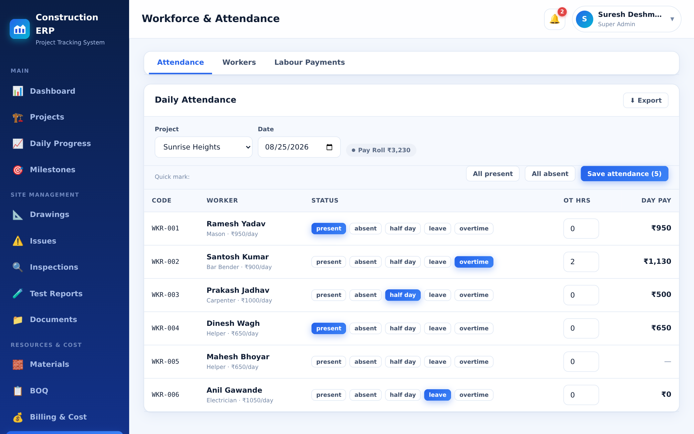

**Tab: Labour Payments** — generate and settle worker wages from attendance.

- **Columns** — Worker (+ code), Period (start → end), Days, OT hrs, Net, Paid, Status badge, **Mark paid** action for unpaid rows.
- **Pending KPI** — sum of (net − paid) across all rows.
- **Generate Payment modal** — Worker, Period start/end, Deductions (₹), optional Pay now (₹). The server sums the worker's attendance over the period: `gross = Σ daily_amount + Σ overtime_amount`, `net = gross − deductions`, writes the payment row with status `pending` (or `partial`/`paid` if money is given at generation).
- **Mark paid** sets `paid_amount = net_amount`, today's date, mode cash → status `paid`.

| Action | API | Tables |
|---|---|---|
| List | `GET /api/labour-payments?projectId=` | `labour_payments` + worker join |
| Generate | `POST /api/labour-payments` `{worker_id, project_id, period_start, period_end, deductions, paid_amount?}` | `attendance` (read over period) → `labour_payments` (computed totals), `audit_logs` |
| Mark paid / edit | `PUT /api/labour-payments/:id` | `labour_payments` (paid_amount, payment_date, payment_mode, status), `audit_logs` |

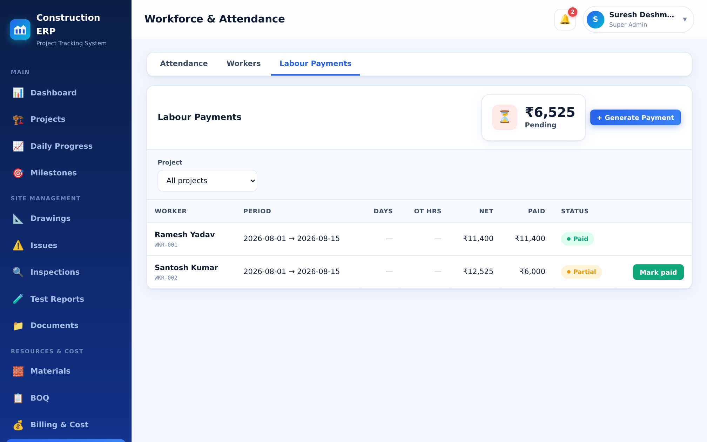

### 4.6 Equipment

Track heavy machinery and site equipment: fleet status, daily hour logs, fuel, and monthly hire billing.

**Summary tiles** — Total fleet (with deployed count), Available, Deployed, Maintenance, Breakdown, **Hours this month** (running hours) with fuel used in litres. From `GET /api/equipment/summary`.

**Fleet table**

- **Columns** — Code, Equipment, Type (excavator, crane, concrete mixer, tower crane, bulldozer, loader, generator, compactor, dumper, scaffolding, pump, other), Ownership (owned / rented / contractor supplied), Project, Hourly rate, Status badge (available / deployed / maintenance / breakdown / idle), Last log date.
- **Filters** — Search (code, name, operator), Status, Type, Ownership.
- **Add / Edit equipment fields** — Code (auto `EQ-…` if blank), Name, Type, Ownership, Project ID, Wing ID, Hourly / Daily / Monthly rate, Capacity, Registration no / asset tag, Operator, Status, Deployed on, Active, Remarks. Delete is allowed only when the unit has **no logs** (history is preserved).

**Equipment detail modal** (row click or Open)

- **Profile card** — status, ownership, rates, registration, operator.
- **Daily log form** — Date, Status after, Deployed hrs, Running hrs, Idle hrs, Breakdown hrs, Fuel (L), Work done, Remarks. Saving inserts an `equipment_logs` row **and flips `equipment.status` to "status after"** — so the fleet board always reflects the latest log.
- **Log history table** — date, hours, fuel, status after, remarks.
- **Hire billing** — "Generate monthly billing" asks for `YYYY-MM`; the server sums the month's **running hours × hourly rate** and writes an `equipment_billing` row (payment status pending/partial/paid, paid amount editable afterwards). Billing rows are listed with month, hours, rate, total, status, paid.

| Action | API | Tables | Side effects |
|---|---|---|---|
| Fleet list | `GET /api/equipment?search=&status=&equipment_type=&ownership=&page=` | `equipment` + `projects`, last-log subquery | Scope-filtered |
| Summary | `GET /api/equipment/summary` | `equipment` (by status), `equipment_logs` (month hours + fuel) | — |
| Add/edit | `POST /api/equipment` · `PUT /api/equipment/:id` | `equipment`, `audit_logs` | — |
| Delete | `DELETE /api/equipment/:id` | `equipment` (409 if logs exist), `audit_logs` | — |
| Save daily log | `POST /api/equipment/logs` `{equipment_id, project_id, log_date, deployed_hours, running_hours, idle_hours, breakdown_hours, fuel_quantity, work_done, remarks, status_after}` | `equipment_logs`, **`equipment.status` updated** | `audit_logs` |
| Edit log | `PUT /api/equipment/logs/:id` | `equipment_logs` | — |
| Detail (profile + logs + billing) | `GET /api/equipment/:id` | `equipment`, `equipment_logs`, `equipment_billing` | — |
| Generate hire bill | `POST /api/equipment/billing/generate` `{equipment_id, billing_month}` | `equipment_logs` (read running hours) → `equipment_billing` (hours × hourly_rate) | Re-generating an existing month re-totals it; `audit_logs` |
| Edit billing / mark paid | `PUT /api/equipment/billing/:id` | `equipment_billing` | — |

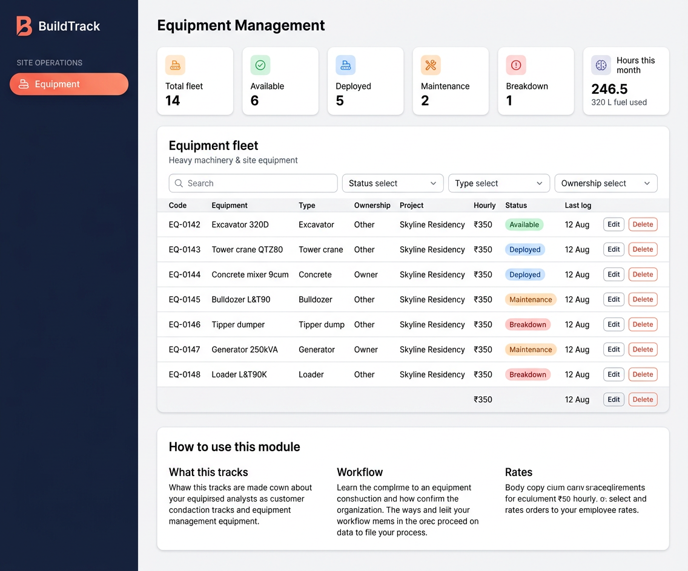
### 4.7 Tasks & Milestones

Schedule and track key project events (foundation complete, slab cast, possession, etc.).

- **Columns** — Milestone (name + project · wing), Start, Target, Progress bar (green at 100%), Status badge, Responsible person.
- **Filters** — Project, Status (pending / in_progress / completed / delayed).
- **CRUD fields** — Project, Name, Start date, Target date, Progress % (**entering 100 auto-completes** the milestone — status flips to completed), Status, Responsible person (user directory), Completion date, Description, Remarks.
- Overdue milestones (past target, not completed) surface as **delayed** in the dashboard overview.

| Action | API | Tables | Side effects |
|---|---|---|---|
| List/create/edit/delete | `GET|POST|PUT|DELETE /api/milestones…` | `milestones` (+ project, responsible user joins), `audit_logs` | Delay detection → `notifications` event `milestone_delayed` to users with `milestones.approve` |

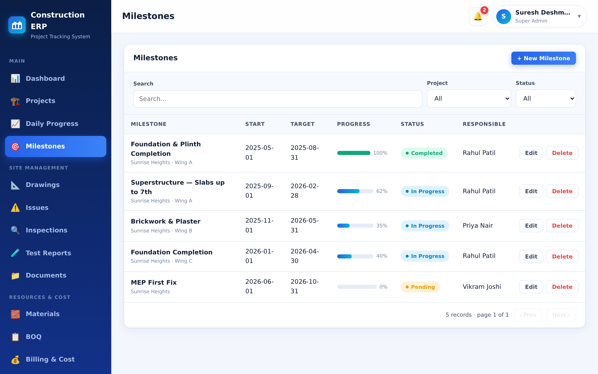

### 4.8 Drawings

Version-controlled drawing control with revision approval.

**List** — Drawing No., Title (+ project · wing), Category badge (architectural / structural / electrical / plumbing / hvac / fire_fighting / interior / other), current **Rev** badge, Approval status, Uploaded by. Filters: search, project, category.

**Upload Drawing** — Project, Wing (optional), Drawing number (required), Category, Title (required), First revision no (default `R0`), Revision date, File (PDF/image), Remarks. The file is stored in `file_uploads` and the first row of `drawing_revisions` is created.

**Drawing detail modal**

- Header: project, category, status, latest revision.
- **Revision History** table — Rev, Date, status, uploaded by, remarks, preview/download buttons.
- **Add revision** — revision no, date, remarks, file → new revision row with status `pending`.
- **Approve / Reject revision** (when `drawings.approve`) — on approval the drawing's `approval_status` becomes **approved** and the new file is the current one; on rejection it goes to `rejected`.

| Action | API | Tables | Side effects |
|---|---|---|---|
| List | `GET /api/drawings?page=&search=&projectId=&category=` | `drawings` (+ latest revision), `file_uploads` | — |
| Upload | `POST /api/drawings` (multipart) | `file_uploads`, `drawings`, `drawing_revisions` (R0), `audit_logs` | `notifications` event `drawing_revision` to drawing approvers |
| Detail | `GET /api/drawings/:id` | `drawings` + `drawing_revisions` + files | — |
| Add revision | `POST /api/drawings/:id/revisions` (multipart) | `file_uploads`, `drawing_revisions` (status pending), `audit_logs` | Notification to approvers |
| Approve/reject | `PUT /api/drawings/revisions/:revisionId/status` | `drawing_revisions`, **`drawings.approval_status` + latest revision updated** | `audit_logs`, notification |
| Preview / download | `GET /api/files/:id` | `file_uploads` | Authenticated object URL |

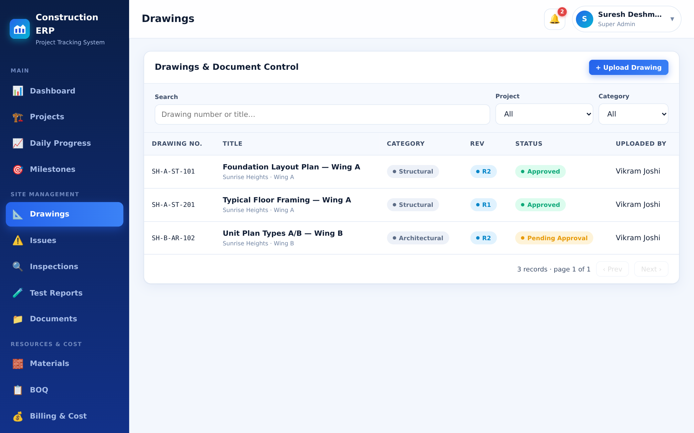

### 4.9 Inspections

On-site inspection checklists (safety, pre-pour, finishing, etc.).

**List** — No. (INS-…), Type badge, Project (+ wing · location), Date, Inspector, GPS link, Status badge (pending / passed / failed / reinspection_required / closed). Filters: project, status. **Close** action for pending/failed/reinspection rows (requires `inspections.approve`).

**New Inspection modal**

1. Inspection type (from Masters → Inspection Types; the type carries a **checklist template** of items).
2. Project, Wing, Location, Date/time, Inspector (user directory).
3. **Checklist** — one row per item with result **pass / fail / N-A**; add or remove rows.
4. **Capture GPS** (browser geolocation) — stored with the inspection.
5. Save → status `pending`; the result status is derived (any fail → `failed`, else `passed`).

| Action | API | Tables | Side effects |
|---|---|---|---|
| List | `GET /api/inspections?page=&projectId=&status=` | `inspections` (+ type, project, inspector) | — |
| Create | `POST /api/inspections` `{…form, items:[{checklist_item, result}]}` | `inspections`, `inspection_items` (one row per checklist line), `audit_logs` | Failed result → `notifications` event `inspection_failed`; type checklist loaded from `inspection_types.checklist_template` |
| Detail | `GET /api/inspections/:id` | `inspections` + `inspection_items` | — |
| Update / close | `PUT /api/inspections/:id` | `inspections`, `audit_logs` | — |

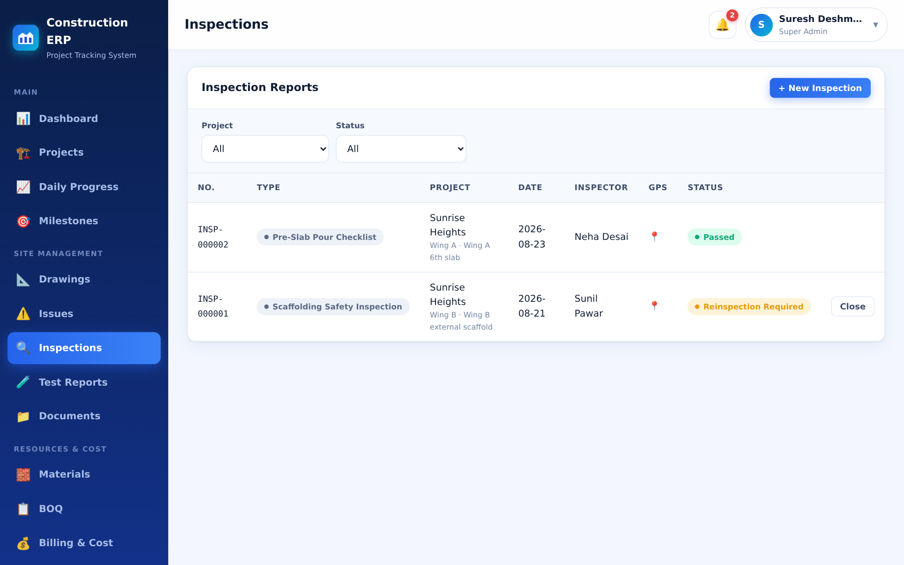

### 4.10 Test Reports (quality)

Material laboratory test register with an approve/reject workflow.

**List** — Test No., Test (type), Project (+ wing), Material, Test date, Laboratory, **Result** (pending / pass / fail / inconclusive), status, **⬇ PDF** download when a file is attached. Filters: result, test type.

**New Test Report fields** — Project, Wing, Test type (from Masters → Test Types), Material (optional), Sample date, Test date, Laboratory, Standard/spec, Result (default pending), Test result / values (multi-line), Remarks, report file upload.

**Workflow** — when a report is in status `submitted`, approvers (`test_reports.approve`) get inline **Approve / Reject** buttons.

| Action | API | Tables | Side effects |
|---|---|---|---|
| List/create/edit/delete | `GET|POST|PUT|DELETE /api/test-reports…` | `test_reports` (+ type, material joins), `file_uploads` when a PDF is attached, `audit_logs` | `result_status = fail` → `notifications` event `test_failed` to quality approvers |
| Approve/reject | `PUT /api/test-reports/:id/status` | `test_reports.status` (submitted → approved/rejected) + `approved_by/at` | `audit_logs`, notification |
| PDF download | `GET /api/files/:id` | `file_uploads` | Authenticated object URL |

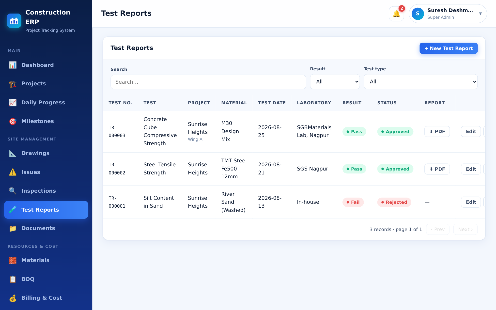

### 4.11 Documents

Project document vault with expiry tracking.

- **Categories** — agreement, certificate, approval, noc, project image, demo image, site photo, client document, government document, other.
- **List columns** — Title, Category, Document no, Version, Expiry (highlighted **amber when expiring within 30 days**), File name, Uploaded by. Filters: category, project, search.
- **Upload** — Project, Wing (optional), Title (required), Category, Document number, Version, Expiry date, Description, File (PDF / image / Office docs).
- **Actions** — ⬇ Download (authenticated file URL), Delete (with confirmation).
- Documents near expiry appear on the **Dashboard** ("Documents expiring soon") and raise the `document_expiry` notification event.

| Action | API | Tables | Side effects |
|---|---|---|---|
| List | `GET /api/documents?limit=&category=&projectId=&search=` | `project_documents` (+ files, uploader) | — |
| Upload | `POST /api/documents` (multipart) | `file_uploads`, `project_documents`, `audit_logs` | — |
| Download / delete | `GET /api/files/:id` · `DELETE /api/documents/:id` | `file_uploads` · `project_documents` | Audited |

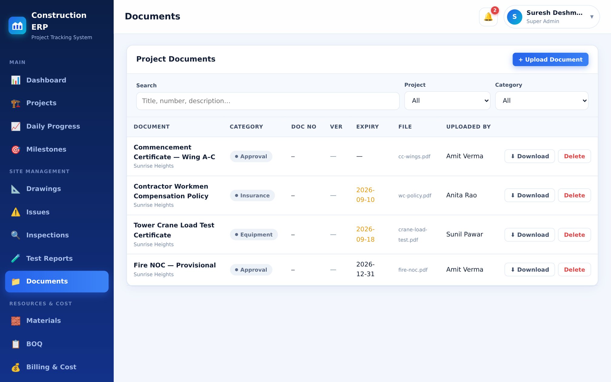

### 4.12 Issues / Snags

Field issues with priority, assignment, due dates, photos and a discussion thread.

**List** — No. (ISS-…), Issue (title + project · wing · location), Category, Priority badge (low / medium / high / critical), Status badge, Assigned to, Due (red when overdue and not resolved/closed). Filters: project, status, priority.

**Raise Issue modal** — Project, Wing, Title (required), Category (from Masters → Issue Categories), Priority, Assign to (user directory), Due date, Location, Description, optional photos (multipart).

**Issue detail modal**

- Full header: project/wing/location, priority + category, raised by (+ GPS link), due date, description, photos.
- **Status & assignment editor** (visible to `issues.edit` holders or the assignee): status select and assignee select → Save.
- **Discussion** — chronological comment thread with author + timestamp; add comments inline (Enter or Send).

**Status workflow:** `open → assigned → in_progress → resolved → closed`, with **reopen** from resolved/closed back to `in_progress`.

| Action | API | Tables | Side effects |
|---|---|---|---|
| List | `GET /api/issues?page=&projectId=&status=&priority=` | `issues` (+ category, assignee, project) | — |
| Raise | `POST /api/issues` (multipart) | `issues` (number auto `ISS-####`), `file_uploads`+issue photos when attached, `audit_logs` | `notifications` `issue_created` to watchers; `issue_assigned` to the assignee when set |
| Detail | `GET /api/issues/:id` | `issues` + comments + photos | — |
| Update status/assignee | `PUT /api/issues/:id` | `issues`, `audit_logs` | `notifications` `issue_updated` to affected users |
| Comment | `POST /api/issues/:id/comments` | `issue_comments`, `audit_logs` | — |
| Overdue sweep | server-side on reads | `issues` | `notifications` `issue_overdue` |

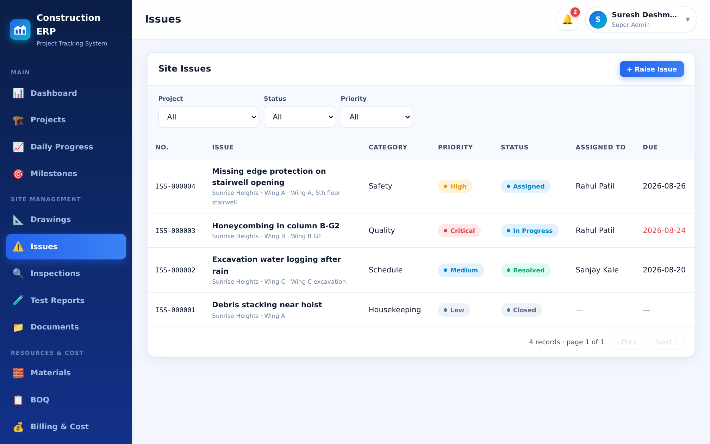
### 4.13 Materials & Inventory

Seven tabs covering the complete material lifecycle — the largest module in the portal:

**Tabs:** `Materials` · `Stock & Alerts` · `Requirements` · `Purchase Orders` · `Receipts (GRN)` · `Consumption` · `Suppliers`

The tab is deep-linkable via `?tab=pos` etc. (notifications to POs land you on the right tab).

#### Tab 1 — Materials (master)

- **Columns** — Code, Name, Category, Unit, Min Stock, Active.
- **Filter** — Category. **Search** — name/code.
- **CRUD fields** — Name, Code (required), Category (from Masters → Material Categories), Unit (bags / kg / ton / cft / cum / sqft / sqm / nos / meter / litre / month), **Min stock level** (the alert threshold), Active, Description.
- Export CSV available.

| Action | API | Tables |
|---|---|---|
| List/create/edit/delete | `GET|POST|PUT|DELETE /api/materials…` | `materials`, `audit_logs` |
| Categories | `GET|POST|PUT|DELETE /api/materials/categories…` | `material_categories` (managed from Admin Masters) |

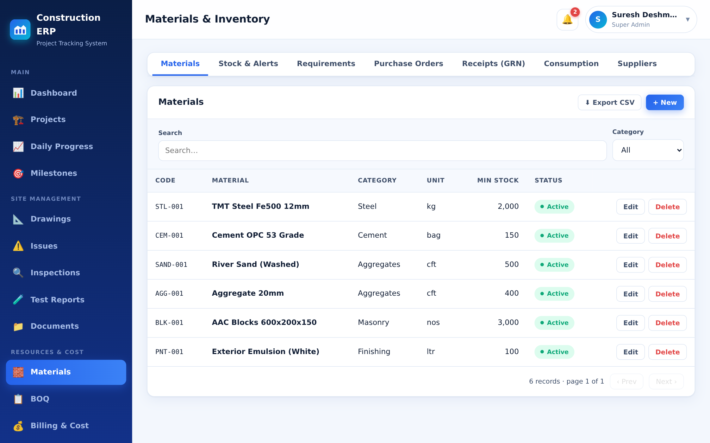

#### Tab 2 — Stock & Alerts

The live stock position, **computed from the transactions ledger** — there is no hand-edited stock number.

- **Columns** — Material (+ code), Project, Received, Consumed, Damaged, Returned, **Current Stock** (qty + unit), **Alert** (LOW STOCK badge when `current_stock <= min_stock_level` and the level is set).
- **Filters** — search, project. **Refresh** button.
- **📜 Transactions** toggle reveals the recent **stock ledger**: date, material, type (opening / receipt / consumption / return — receipts & openings green, others red), quantity (negative in red), reference module + id, by whom.

| UI | API | Tables |
|---|---|---|
| Stock position | `GET /api/materials/stock?search=&projectId=` | `stock_transactions` aggregated per material/project (received = Σ+ receipts, consumed = Σ−, damaged, returned) + `materials` for min level |
| Ledger | `GET /api/materials/stock/transactions?projectId=` | `stock_transactions` (newest first) |
| Low-stock alerts feed | `GET /api/materials/stock/low-stock-alerts` | same aggregation, filtered to `low_stock = 1` |

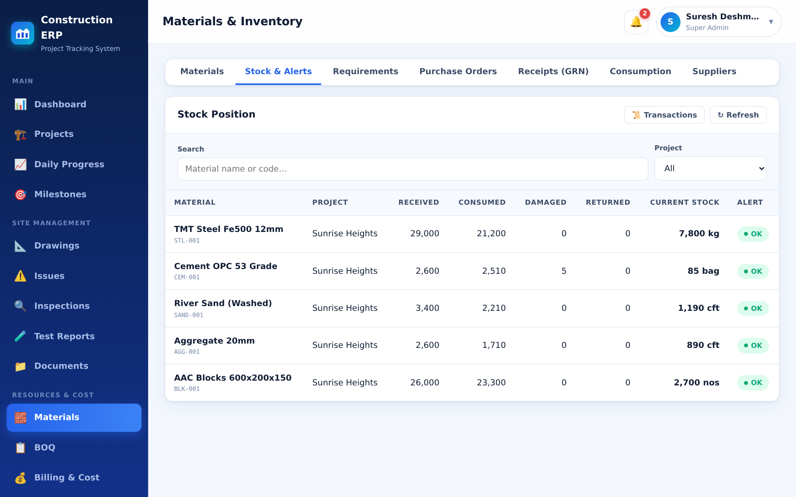

#### Tab 3 — Requirements

Raise a material need; store approves; procurement follows.

- **Columns** — Req No. (REQ-…), Material, Project (+ wing), Qty + unit, Needed by, Requested by, Status.
- **Filter** — Status: `pending → approved | rejected → po_created → fulfilled`.
- **New Requirement fields** — Project, Wing, Material, Required qty, Unit, Required date, Remarks.
- **Approve / Reject** buttons on pending rows (`materials.approve`).

| Action | API | Tables | Side effects |
|---|---|---|---|
| List/create/edit/delete | `GET|POST|PUT|DELETE /api/materials/requirements…` | `material_requirements`, `audit_logs` | — |
| Approve / Reject | `PUT /api/materials/requirements/:id/status` | `material_requirements` (status, approved_by, approved_at) | `notifications` event `po_approval` (requirement decision) to the requester |

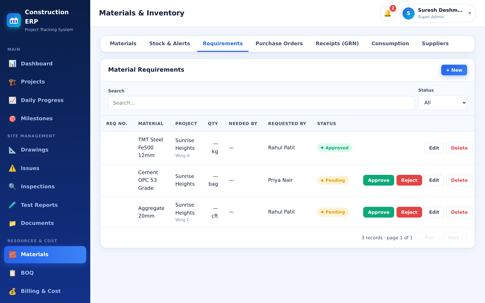

#### Tab 4 — Purchase Orders

- **Columns** — PO No. (PO-…), Supplier, Project, Date, Expected delivery, Grand total, Status.
- **Filter** — Status: `draft → pending_approval → approved → sent → partially_received → received`, plus `cancelled`.
- **Row actions** — **Submit** (draft → pending_approval), **Approve** (→ approved, `materials.approve`), **Mark sent** (→ sent).
- **New PO modal** — Project, Supplier, PO date, Expected delivery, Discount (₹), Remarks + **items grid**: material (unit auto-filled), qty, unit, rate ₹, tax % (default 18) per line; **Subtotal / Tax / Grand total computed live** (subtotal = Σ qty×rate; tax per line; grand = subtotal + tax − discount).
- **PO detail modal** — header (supplier, project, status, total incl. tax), items table (ordered vs received qty, rate, amount), and — when status is approved/sent/partially_received — the **Record Receipt (GRN)** panel: per item "Received" and "Damaged" inputs showing pending quantity.

| Action | API | Tables | Side effects |
|---|---|---|---|
| List | `GET /api/materials/purchase-orders?page=&status=` | `purchase_orders` + supplier/project, item sums | — |
| Create | `POST /api/materials/purchase-orders` `{…header, items:[{material_id, quantity, unit, rate, tax_percent}]}` | `purchase_orders` (totals computed server-side: subtotal, tax, grand), `purchase_order_items`, `audit_logs` | — |
| Detail | `GET /api/materials/purchase-orders/:id` | PO + items (with running `received_qty`) | — |
| Status changes | `PUT /api/materials/purchase-orders/:id/status` | `purchase_orders` (+ approved_by/at) | Approve → notification to creator (`po_approval`) |

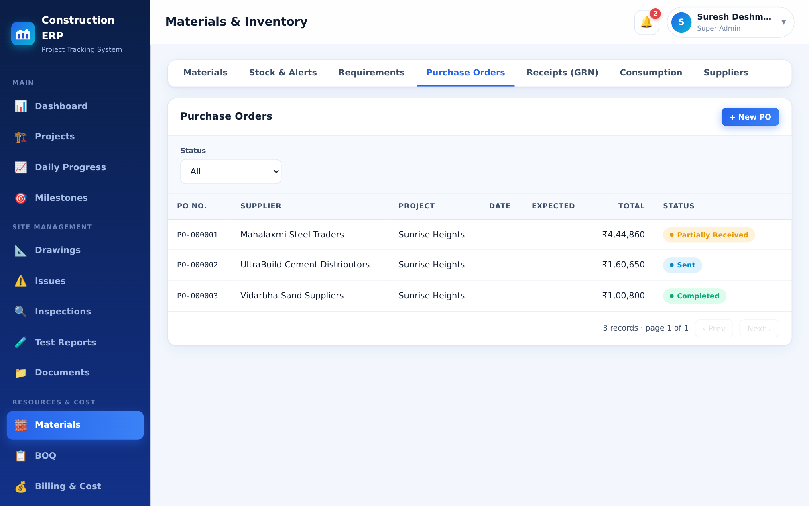

#### Tab 5 — Receipts (GRN)

- **Columns** — GRN No., Date, Supplier, Project, PO Ref, Challan. Row click → detail with per-item **Received / Damaged / Accepted** (accepted = received − damaged).
- Receipts are normally recorded from the PO detail (above); the tab is the register.

**Recording a GRN (data flow)**

| Step | API | Tables written | Side effects |
|---|---|---|---|
| Save GRN | `POST /api/materials/receipts` `{po_id, project_id, receipt_date, items:[{po_item_id, received_qty, damaged_qty}]}` | `material_receipts` (GRN-…), `material_receipt_items` (accepted_qty computed) | **`stock_transactions` +receipt per item (accepted qty)**; damaged qty tracked separately; `purchase_order_items.received_qty` increased; PO auto-moves to `partially_received` or `received`; `notifications` `material_received` to store approvers; if stock falls to/below min level after consumption elsewhere, `material_shortage` alert; `audit_logs` |

#### Tab 6 — Consumption

Record material used on site.

- **Columns** — Date, Material, Project, Qty + unit, Location, Wing, By.
- **Fields** — Project, Wing, Material, Quantity, Unit, Date, Location, Remarks.
- The server performs a **live stock check**: it reads current stock from the ledger and inserts a **negative** `stock_transactions` row; consuming more than available is rejected.

| Action | API | Tables | Side effects |
|---|---|---|---|
| List/create/edit/delete | `GET|POST|PUT|DELETE /api/materials/consumption…` | `material_consumption` + `stock_transactions` (−qty) | `audit_logs`; low-stock alert event when crossing the min level |
| Returns | `POST /api/materials/returns` · `PUT /api/materials/returns/:id/approve` | `material_returns` + `stock_transactions` (+qty on approval) | Approved returns add stock back |

#### Tab 7 — Suppliers

- **Columns** — Name, Code, Contact, Phone, GST No, City.
- **Fields** — Name, Code, Contact person, Phone, Email, GST number, Address, City, State, PIN.

| Action | API | Tables |
|---|---|---|
| CRUD | `GET|POST|PUT|DELETE /api/materials/suppliers…` | `suppliers`, `audit_logs` |

#### The complete material cycle (summary)

```
Requirement (REQ) ──approve──▶ Purchase Order (PO) ──approve──▶ Sent to supplier
        │                          │                              │
        │                          │  Supplier delivers           ▼
        │                          │                    GRN (received / damaged)
        │                          │                       │  +stock_transactions (receipt)
        │                          │                       ▼
        └──────────────────────────┴──────────────▶ Stock position (live from ledger)
                                                        │
                            Site uses material ◀───────┤  LOW STOCK alert when
                            Consumption (−ledger)      │  stock ≤ min level
                                                        │
                            Returns (+ledger on approval)
```

### 4.14 BOQ (Bill of Quantities)

Estimated cost baseline per project (optionally per wing), compared against actuals.

**BOQ List**

- **Columns** — BOQ No. (BOQ-…), Title (+ project · wing), Estimated, Actual, **Variance** (red if over budget, green if under), Status.
- **Filter** — Status: draft / active / completed / cancelled.
- **New BOQ fields** — Project, Wing (optional), Title, Tax % (default 18), Discount (₹), Status, Description.
- **⇪ Import items** — paste CSV rows `item_code, description, unit, estimated_qty, rate, actual_qty` (first line = header); a **template** can be downloaded from `/api/boq/template-csv`. Import goes through `POST /api/boq/:id/import-json` (rows are parsed in the UI and posted as JSON).
- Export CSV per BOQ and for the whole list.

**BOQ Detail** (`/boq/:id`)

- **KPI band** — Estimated, Actual, Variance (₹ + %), Tax (at BOQ tax %), Grand Total.
- **Items table** — Code, Description (+ category), Unit, Est. Qty, Rate, Est. Amt, Act. Qty, Act. Amt, **Var %** (per item), Edit.
- **Add / Edit item modal** — Item code, Category (from Masters → BOQ Categories), Description, Unit, Rate, Estimated qty, Actual qty, live Estimated amount / Actual amount / Variance, Remarks.

**Calculation rules (server-side):** item est. amt = est. qty × rate; act. amt = act. qty × rate; BOQ totals roll up items; tax and discount applied at header level; variance % = (actual − estimated) / estimated.

| Action | API | Tables |
|---|---|---|
| List | `GET /api/boq?page=&status=&search=` | `boq` + item total aggregation |
| Create | `POST /api/boq` | `boq`, `audit_logs` |
| Detail | `GET /api/boq/:id` | `boq` + `boq_items` + computed `totals` |
| Save item (new or edit) | `PUT /api/boq/:id` (whole items array) or `PUT /api/boq/items/:itemId` | `boq_items`, `boq` (totals recomputed), `audit_logs` |
| Import | `POST /api/boq/:id/import-json` | `boq_items` (bulk), totals recomputed |
| Export / template | `GET /api/boq/export` · `GET /api/boq/:id/export` · `GET /api/boq/template-csv` | CSV generation, audited |

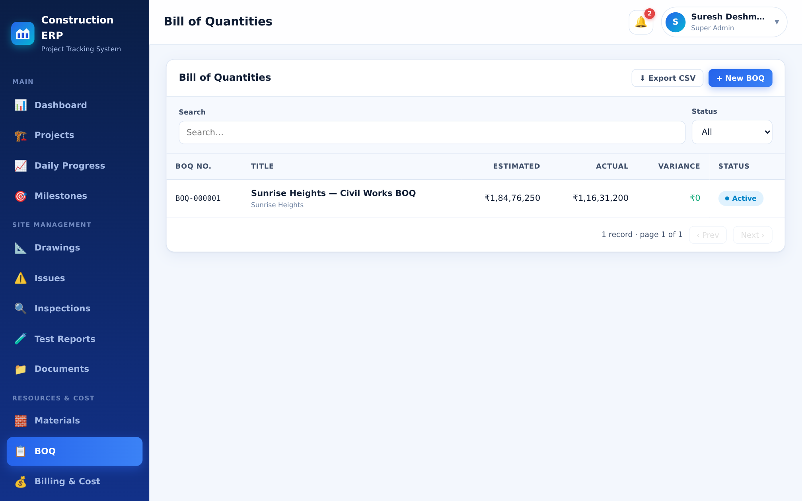

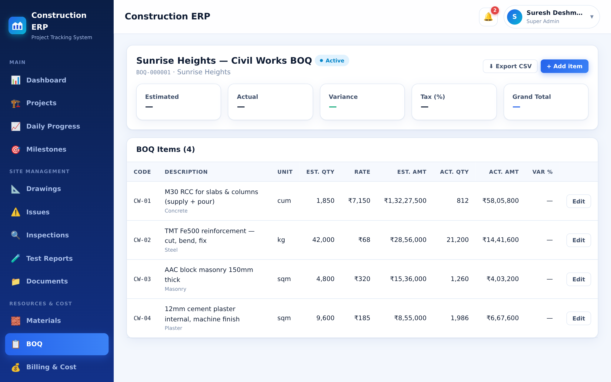

### 4.15 Payments (Billing & cost entries)

Record project costs against vendors and track what has been paid.

**KPI band** — Total Cost, Paid, Pending Payments, plus a **cost breakdown by project** stacked bar (Consumables / Equipment / Labour, ₹ lakhs) from `GET /api/billing/summary`.

**Cost entries table**

- **Columns** — Date, Type badge (consumable / non-consumable / labour / other), Description (+ project · wing), Category, Qty, Total, Paid, **Pending** (red when > 0), Payment status (unpaid / partial / paid).
- **Filters** — Type, Payment status, Project.
- **New Cost Entry fields** — Project, Wing, Type, Category (Cement, Bricks, Sand, Steel, Aggregate, Tiles, Pipes, Electrical, Paint, Other, Machinery, Equipment, Crane charges, Excavator charges, Vehicle charges, Rental equipment), Description, Date, Bill/invoice no, Bill date, Quantity, Unit, Rate, **Tax/GST % (default 18)**, Paid amount, Vendor/supplier (from Materials → Suppliers), Remarks. `total_amount` = qty × rate × (1 + tax) is computed server-side when quantity/rate are given; `pending_amount` = total − paid.

| Action | API | Tables |
|---|---|---|
| List + filters | `GET /api/billing/cost-entries?entry_type=&payment_status=&projectId=` | `cost_entries` + project/supplier joins, scope-filtered |
| Create / edit / delete | `POST|PUT|DELETE /api/billing/cost-entries…` | `cost_entries`, `audit_logs` (payment_status derived from paid vs total) |
| Summary | `GET /api/billing/summary` · `GET /api/billing/summary/by-wing` | `cost_entries` aggregated per project (and per wing) |
| Export | `GET /api/billing/cost-entries/export` | CSV, audited |

These entries feed the **Dashboard vendor dues** KPI, the **Budget vs Actual** chart/report, and the `pending-collections`/`project-cost` reports.

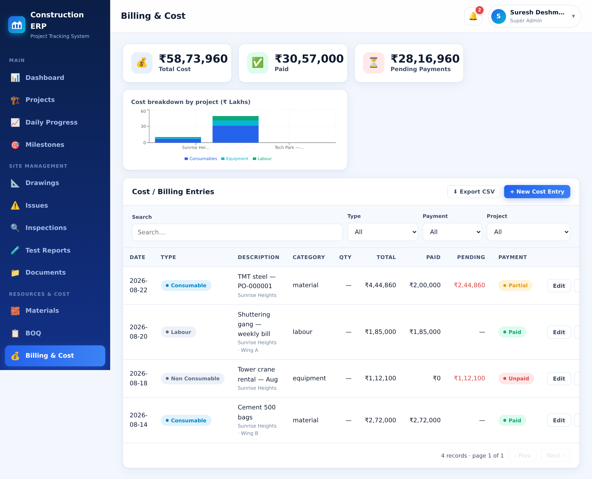
### 4.16 Petty Cash

Track site cash: top-ups (cash in), expenses, replenishments.

**When a project is selected** the summary appears:

- **Cash on hand** — big balance figure: `top-ups + replenishments − expenses`.
- **Spend by category** — horizontal bars per category (Travel / conveyance, Food / catering, Fuel & lubricants, Labour incentives, Tools & consumables, Office & admin, Misc).
- **Recent activity** — last 5 entries with type badge (topup green, replenish blue, expense orange), paid-to, amount.

**Entries table** — Date, Type, Category, Paid to, Description, Amount, Project. Filters: project, search, type, category. Actions: Edit / Delete (per permission), **⬇ Export**, **+ Add entry**.

**New entry fields** — Project (required; pre-filled from the filter), Txn type (`topup` / `expense` / `replenish`), Date, Amount, Category, Paid to, Received by, Description, Remarks.

| Action | API | Tables | Side effects |
|---|---|---|---|
| List | `GET /api/petty-cash?projectId=&search=&txn_type=&category=&page=` | `petty_cash_entries` + project join, scope-filtered | — |
| Summary | `GET /api/petty-cash/summary?projectId=` | `petty_cash_entries` aggregated (balance, by category, recent) | — |
| Create / edit / delete | `POST|PUT|DELETE /api/petty-cash…` | `petty_cash_entries`, `audit_logs` | — |
| Export | `GET /api/petty-cash/export?…` (honours current filters) | CSV, audited | — |

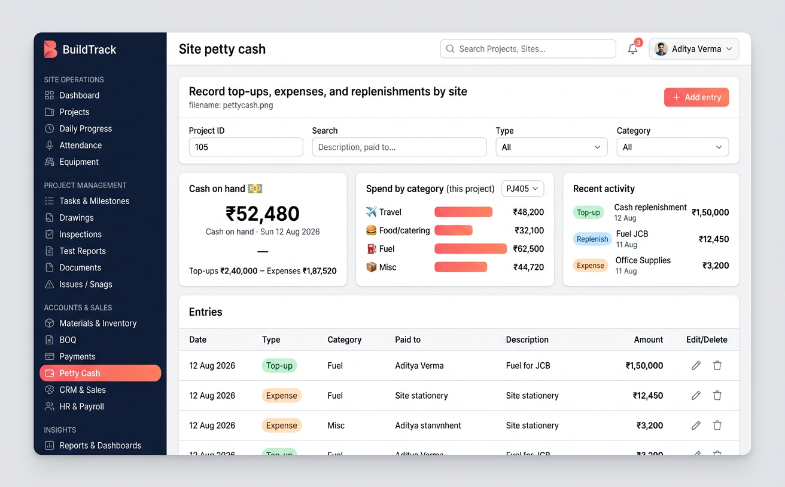

### 4.17 CRM & Sales

Sell the units that were defined under Projects → Floors & Units, and chase collections.

**KPI band** — Units Sold (with available count), Sales Value, Collected, **Pending Collections**, and a **Sales register ⬇ CSV** export card. Below, a unit-availability funnel (available / booked / sold counts) from `GET /api/sales/unit-availability`.

**Unit Sales table**

- **Columns** — Unit (number + wing · floor · type), Customer (+ phone), Sale date, Amount (+ incl. GST note), Received, **Pending** (red), Payment status (pending / partially_paid / paid / overdue), GST badge.
- **Filters** — Payment status, GST (yes/no).
- **New Sale fields** — **Unit** (only units currently `available` are listed), Customer name, Customer mobile, Sale amount, Amount received, Booking date, Sale date, **GST applicable (5%)** checkbox, GST %, Other charges, Status (booked / sold).
- **+ Payment** on any row with a pending balance opens **Collect payment**: amount (defaults to pending), date, mode (online / bank transfer / upi / cheque / cash), includes-GST flag, reference/UTR, plus the full **payment history** for that sale.

**Side effect on units:** creating a sale flips the unit `units.status` from `available` to `booked` or `sold`; deleting it returns the unit to `available`. Pending collections trigger the `sales_payment_due` notification event.

| Action | API | Tables | Side effects |
|---|---|---|---|
| Summary / funnel | `GET /api/sales/summary` · `GET /api/sales/unit-availability` | `sales` + `sales_payments`, `units` counts | — |
| List | `GET /api/sales?page=&payment_status=&is_gst=` | `sales` + unit/project joins | — |
| New sale | `POST /api/sales` | `sales` (GST amount computed, pending = amount − received), **`units.status` → booked/sold**, `audit_logs` | `notifications` `sales_payment_due` when pending remains |
| Detail | `GET /api/sales/:id` | `sales` + `sales_payments` history | — |
| Record payment | `POST /api/sales/:id/payments` `{amount, payment_date, payment_mode, is_gst, reference_number}` | `sales_payments`, `sales.amount_received`/`pending_amount`/`payment_status` updated | Overdue → dashboard & notifications |
| Export | `GET /api/sales/export` | CSV, audited | — |

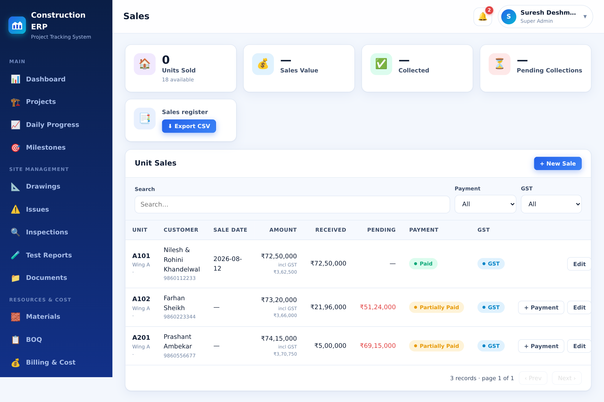

### 4.18 HR & Payroll

The shared employee directory (same records as Admin Console) with leave, salary structures and monthly payroll.

**Summary tiles** — Active employees, On leave (today), Pending leave requests, Payroll due for the current month (pending net).

Four tabs: **Employees · Leave · Salary structures · Payroll**.

#### Tab 1 — Employees

- **Filters** — search (name, code, email), Department, Status (active / on_leave / resigned / terminated). Pagination.
- **Columns** — Code, Name, Designation (+ linked role name), Dept, Project, **Login** (green "Linked · username" badge or gray "No login"), Status, Joined, row actions (Details / Edit / Delete).
- **Add / Edit fields** — Employee code, Full name, Email, Phone, **Designation / role** (from Masters → Designations; option labels show the linked login role), **Department** (from Masters → Departments), Date of joining, Date of birth, Gender, Employment type (permanent / contract / probation / intern), Status, Project, Wing, Bank account, PAN, Aadhaar, Address, Active, Remarks.
- **Login access block** (in the same modal):
  - *New employee:* "Create login credentials" checkbox (requires `users.create` permission) → temporary password (min 8 chars) + **login role** chips. The role linked to the chosen **designation is added automatically**; other selected roles are retained.
  - *Existing employee with no login:* the same block provisions credentials and links the account (one-to-one; a duplicate link is blocked).
- **Employee details modal** (row click) — Profile card (all fields + project/wing), Login access card (account, email, status, masked bank account •••• last4), **Leave balance** table for the current year (type, quota, used, pending, remaining), **Salary history** (effective date, basic, HRA, PF), **Recent leave** and **Recent payroll** tables.

| Action | API | Tables | Side effects |
|---|---|---|---|
| List | `GET /api/hrms/employees?page=&search=&department=&status=` | `hrms_employees` + projects/wings + linked `users` + designation→role names | — |
| Detail | `GET /api/hrms/employees/:id` | employee + `hrms_salary_structures`, recent leave & payroll | — |
| Create | `POST /api/hrms/employees` (+ optional `create_login`, `login_password`, `login_role_ids`) | `hrms_employees`; when login requested: `users` (bcrypt), `user_roles` (selected + designation-linked role), `hrms_employees.user_id` set, `audit_logs` | Shared directory row appears in Admin Console instantly |
| Edit | `PUT /api/hrms/employees/:id` | `hrms_employees`, `audit_logs` | Login linking same as create (only when not yet linked) |
| Delete | `DELETE /api/hrms/employees/:id` | `hrms_employees` — **linked login is retained but unlinked** | `audit_logs` |
| Departments / designations | `GET /api/hrms/departments` · `GET /api/hrms/designations` | `hrms_departments`, `hrms_designations` (managed from Admin Masters) | — |
| Login roles list | `GET /api/hrms/login-roles` | active `roles` | — |

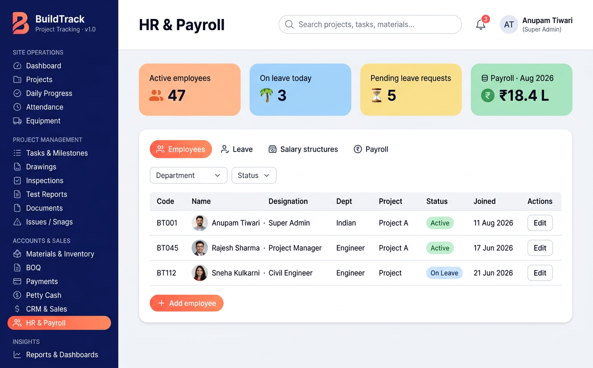

#### Tab 2 — Leave

- **List** — Employee, Type (code badge), From, To, Days, Status (pending / approved / rejected). Filters: status, search.
- **New request** — Employee (active only), Leave type (from Masters → Leave types with quota & paid flag), From, To (days computed), Reason.
- **Approve / Reject** via `PUT /api/hrms/leave-requests/:id/decide` (requires `hrms.approve`; Admin Console shows the same workflow). Approved **unpaid** leave feeds payroll loss-of-pay.

| Action | API | Tables |
|---|---|---|
| List | `GET /api/hrms/leave-requests?status=&search=` | `hrms_leave_requests` + employee + type |
| Create | `POST /api/hrms/leave-requests` | `hrms_leave_requests` (total_days computed), `audit_logs` |
| Decide | `PUT /api/hrms/leave-requests/:id/decide` | `hrms_leave_requests` (status, decided_by, decided_on), `audit_logs` |

#### Tab 3 — Salary structures

- **Columns** — Employee, Dept, Effective, Basic, HRA, **Gross** (basic+HRA+DA+special+other, computed in UI), PF (ee), Edit/Delete.
- **Fields** — Employee, Effective from, Basic, HRA, DA, Special, Other, PF (employee/employer ₹), ESIC (employee/employer), Professional tax, Remarks.
- An employee's **latest active structure** (effective ≤ end of payroll month) is the one payroll uses.

| Action | API | Tables |
|---|---|---|
| CRUD | `GET|POST|PUT|DELETE /api/hrms/salary-structures…` | `hrms_salary_structures`, `audit_logs` |

#### Tab 4 — Payroll

- **Month picker** (defaults to current month) + **Generate monthly payroll** button (`hrms.create`).
- **Columns** — Employee, Dept, **Paid days** (1 dp), Gross, Deductions, **Net**, Payment status (pending / partial / paid), **Record payment** action.
- **Record payment modal** — Amount paid (≤ net), payment date, Reference/UTR. Status is derived: 0 → pending, < net → partial, ≥ net → paid. A month that already has money paid **cannot be regenerated**.

**Payroll calculation (server-side, per employee for the month):**

```
structure = latest active salary structure for the employee
total   = working days in the month
lop     = approved days of UNPAID leave types falling in the month
paid    = total − lop            (ratio = paid / total)
gross   = (basic + HRA + DA + special + other) × ratio
deduct  = min(gross, PF-ee × ratio + ESIC-ee × ratio + prof tax)
net     = gross − deduct
→ hrms_payroll row (payment_status = pending)
```

Bulk generation processes all active employees; those without a structure (or with blocked re-generation) are reported as **skipped** in the toast.

| Action | API | Tables |
|---|---|---|
| List month | `GET /api/hrms/payroll?payroll_month=&page=` | `hrms_payroll` + employee |
| Generate (one) | `POST /api/hrms/payroll/generate` | `hrms_leave_requests` (unpaid approved), `hrms_salary_structures` → `hrms_payroll` insert/update |
| Generate (bulk) | `POST /api/hrms/payroll/generate-bulk` `{payroll_month}` | same, all active employees; skips returned |
| Record payment | `PUT /api/hrms/payroll/:id/payment` | `hrms_payroll` (paid_amount, date, reference, derived payment_status) |
| Summary tiles | `GET /api/hrms/summary` | `hrms_employees`, `hrms_leave_requests`, `hrms_payroll` |

### 4.19 Reports & Dashboards

A self-service reports center — no SQL needed.

- **17 report cards** (grouped by domain): Project Progress, Daily Progress, Milestones, Material Stock, Material Consumption, Purchase Orders, Billing & Cost, BOQ Summary, Test Reports, Inspection Reports, Issues, Worker Attendance, Sales, Budget vs Actual, Pending Collections, Labour Payments, Project Cost.
- **Click a card** → viewer with optional **From/To** date range, the data table (first 12 columns shown), **⬇ Export CSV/Excel** and **🖨 Print / PDF** (browser print).

| UI | API |
|---|---|
| Report list | `GET /api/reports` → `[{key, label}]` |
| View | `GET /api/reports/:key?from=&to=` → `{label, data:[…]}` |
| Export | `GET /api/reports/:key?format=csv&from=&to=` (streamed CSV) |

Each report is a read-only query over the tables documented in the screen sections above (e.g. `budget-vs-actual` joins `projects` with `cost_entries`; `material-stock` uses the same ledger aggregation as the Stock tab).

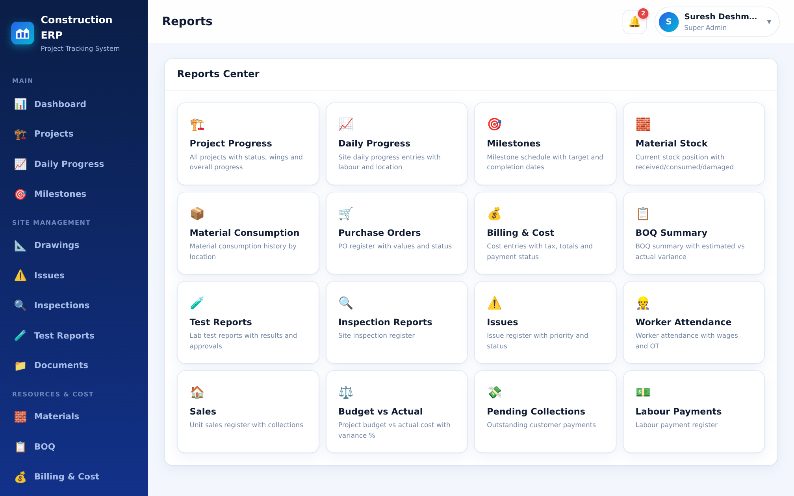

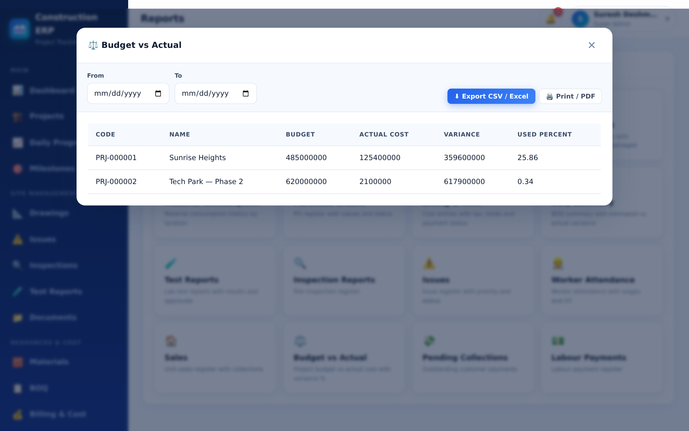

### 4.20 My Profile

Covered in §3.3 — reachable from the user chip in the Web Portal. Includes the HR link card and the project-access list for scoped users.

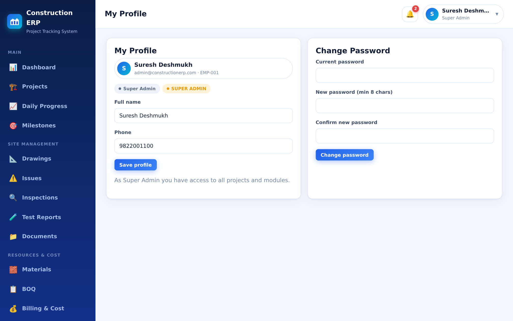

### 4.21 In-app notifications (Web Portal)

Covered in §4.0. Event types raised by the backend: `issue_created`, `issue_assigned`, `issue_updated`, `issue_overdue`, `milestone_delayed`, `po_approval`, `material_received`, `material_shortage`, `test_failed`, `inspection_failed`, `drawing_revision`, `document_expiry`, `sales_payment_due`. Each is individually toggleable in Admin Console → Masters → Notification Events, and each notification carries a `module` + `record_id` used for the deep-link routing.
---

## 5. Admin Console — complete screen & tab guide

The Admin Console (separate login on its own port/URL) is where platform administrators manage **who** can do **what** across **which projects**, keep master data consistent, and watch the system.

### 5.0 Layout & navigation

- **Sidebar groups:**
  - (top) **Admin Dashboard**
  - **Access Control** — Users & Employees (`users.view`), Roles & Permissions (`roles.view`)
  - **Master Data** — Projects & Wings (`projects.view`), Masters (visible to all admins)
  - **People & finance operations** — HR & Payroll (`hrms.view`), Petty Cash (`petty_cash.view`)
  - **System** — Audit Logs (`admin.view`), Broadcast (`notifications.create`)
- **Top bar** — page title, "Admin Console · v1.0" chips, user chip with Logout.
- Every route is guarded by `Require(perm)`; the server re-checks the same permissions.

### 5.1 Admin Dashboard

- **KPI tiles** — Total Users, Roles, Projects, Wings, Total Budget (compact ₹), Open Issues.
- **Users by Role** donut (role → user count), **Activity Trend** (progress reports per day, last 30 days).
- **Recent Audit Activity** table (last 8 events: when, user, action, module, record).
- **Role Distribution** table (role, users, permissions, System/Custom type).

| UI | API | Tables |
|---|---|---|
| KPIs + charts | `GET /api/dashboard/overview` | same aggregates as the web dashboard |
| Users / roles | `GET /api/users?limit=100` · `GET /api/roles` | `users` (+ `user_roles`, `roles.user_count`), `roles` (+ `permission_count`) |
| Recent audits | `GET /api/admin/audit-logs?limit=8` | `audit_logs` |

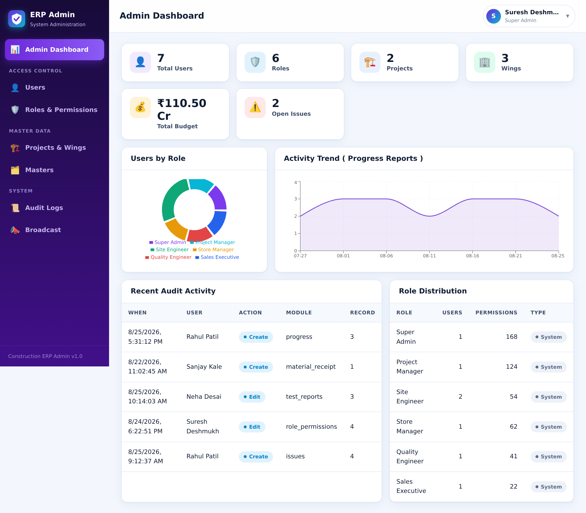

### 5.2 Users & Employees

Manage login accounts **and** their HR/payroll identity in one place.

- **Columns** — User (avatar, name, email), Employee code, Phone, **Roles** (badges), **HR / Payroll** (green "Linked · EMP-xxx" or gray "No employee"), Last login (or "never"), Status.
- **Filters** — search (name, email, code, phone), Role. Pagination. **⬇ Export CSV** (`users.export`).
- **Row actions** — Edit, **Reset PW**, Delete (never on your own account).

**Create / Edit user modal**

1. **Account** — Full name, Email (login), Phone, Employee code, **Temporary password** (new users only, min 8 chars), Status (active/inactive).
2. **HR & Payroll link block** —
   - *New user:* "Create employee record" checkbox (requires `hrms.create`) → Department, Designation (linked-role auto-added to the role set), Date of joining, Employment type, Payroll project, Employee status.
   - *Existing user without employee:* "Convert to employee" — same fields; creates the shared-directory row and links it.
   - *Already linked:* a green "✓ Linked HR/payroll employee" note (no double link).
3. **Roles** — multi-select chips. Non-super-admins cannot see the `admin`/`super_admin` roles in the picker (they cannot grant those). The selected designation's linked role is **auto-included** (shown in a hint).
4. **Project Access** — rows of (Project, Wing or "All wings"). Empty list + a non-global role = the user sees **no projects**; Super Admin / Admin roles are global.

**Reset password modal** — new password (min 8 chars); **all of that user's active sessions are revoked immediately** (`refresh_tokens.revoked_at`).

| Action | API | Tables | Side effects |
|---|---|---|---|
| List | `GET /api/users?page=&search=&roleId=` | `users` + roles + `hrms_employees` link + last login | — |
| Create | `POST /api/users` `{name, email, phone, employee_code, password, status, roleIds, projectAccess, createEmployee?, employee?}` | `users` (bcrypt), `user_roles`, `user_projects` (each row project + wing_id 0=all), and when requested: `hrms_employees` + `hrms_employees.user_id` back-link | Response `meta.employeeId` when an employee was created; `audit_logs` |
| Edit | `PUT /api/users/:id` + `PUT /api/users/:id/roles` (when roles changed) + `PUT /api/users/:id/project-access` | `users`, `user_roles`, `user_projects`, (employee link fields) | `audit_logs` with old/new values |
| Reset password | `PUT /api/users/:id/reset-password` | `users.password`, **all `refresh_tokens` revoked** | User must re-login everywhere |
| Delete | `DELETE /api/users/:id` | `users` — **audit history is preserved** | `audit_logs` |
| Export | `GET /api/users/export` | CSV, audited | — |

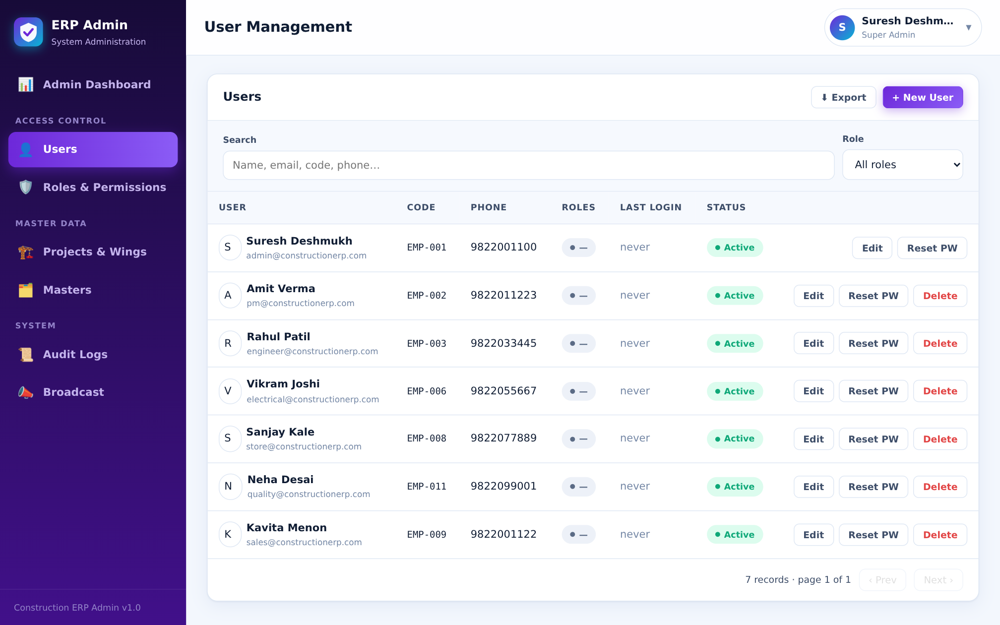

### 5.3 Roles & Permissions

Define the platform's capability model.

- **Columns** — Role (name + code), Description, **HR designation(s)** (names of designations mapped to this role — useful for spotting role/designation drift), Users count, **Permissions** count badge, Type (System/Custom), Status (Active/Inactive).
- **Row actions** — **🛡 Permissions** (open the matrix; the super_admin role itself is read-only), **Delete** (only custom roles **with zero users**).
- **New Role** — name + description (code auto-generated); then configure its permissions.

**Permission matrix modal**

- Grid: **rows = modules**, **columns = the 8 actions** (`view · create · edit · delete · approve · export · upload · download`). A cell is checkable only when that module.action permission exists in the catalogue.
- Clicking the **module name** toggles the whole module.
- Footer shows "N of M granted" and **Save permissions** writes the full set.

| Action | API | Tables | Side effects |
|---|---|---|---|
| Role list | `GET /api/roles` | `roles` + user/permission counts + designation names | — |
| Create role | `POST /api/roles` | `roles`, `audit_logs` | — |
| Matrix data | `GET /api/roles/permissions` (catalogue grouped by module) · `GET /api/roles/:id` (granted ids) | `permissions`, `role_permissions` | — |
| Save matrix | `PUT /api/roles/:id/permissions` `{permissionIds:[…]}` | `role_permissions` (replaced), `audit_logs` | Takes effect on the users' next request (permissions are loaded per token/`/me`) |
| Delete | `DELETE /api/roles/:id` | `roles` (409 if system or in use) | `audit_logs` |

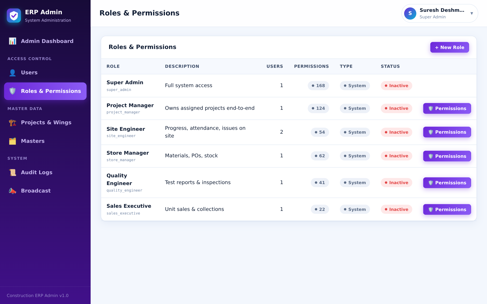

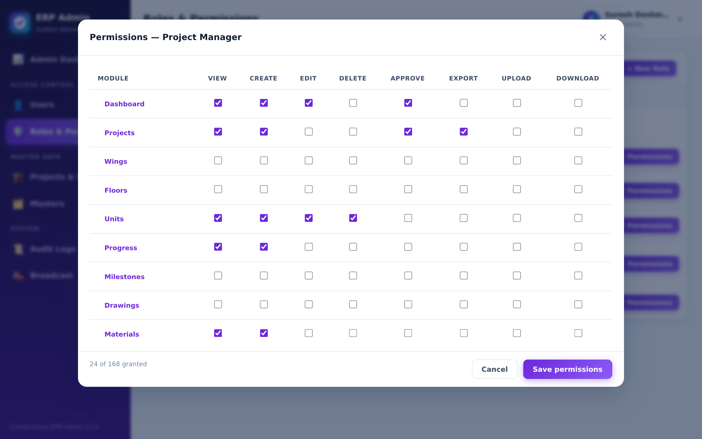

### 5.4 Projects & Wings (admin)

A project-structure console for admins — the same `projects` / `wings` / `floors` tables the portal uses.

- **Projects table** with inline **New Project** (same fields as the portal's New Project modal) and row-level **Edit / Delete / Expand**.
- **Expanded row** shows the project's **Wings** table (add/edit/delete wing with progress + status) and its **Floors** table (per wing: floor, status) — so an admin can set up or repair the hierarchy without touching the portal.

| Action | API | Tables |
|---|---|---|
| Projects CRUD | `GET|POST|PUT|DELETE /api/projects…` | `projects`, `audit_logs` |
| Wings CRUD | `GET|POST|PUT|DELETE /api/wings?projectId=` | `wings`, `audit_logs` |
| Floors | `GET /api/floors?projectId=&wingId=` (+ update) | `floors`, `audit_logs` |

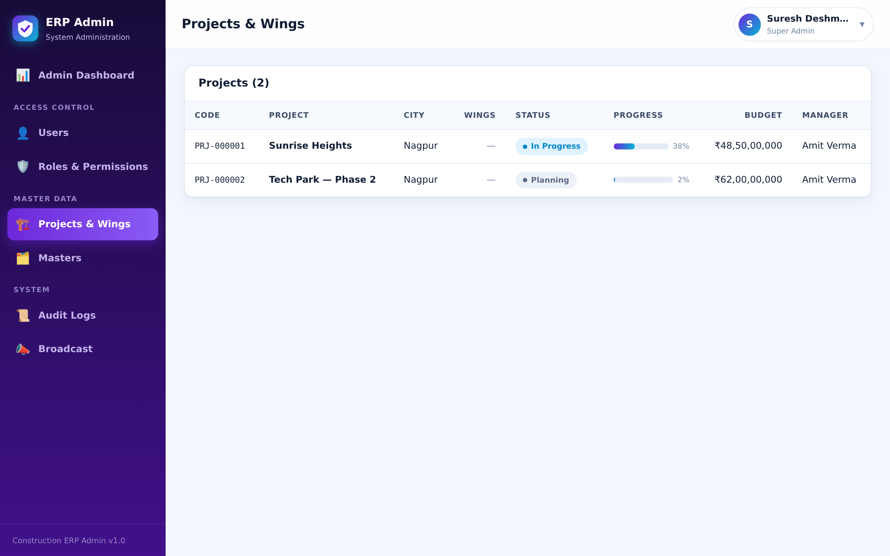

### 5.5 Masters (11 tabs)

Master data that feeds dropdowns across every app. Tab visibility is permission-gated (e.g. HR tabs need `hrms.view`).

| Tab | Manages | Key fields / behaviour |
|---|---|---|
| **Departments** | `hrms_departments` | Name, Code (auto from name if blank), Description, Active. Feeds employee forms in both apps. |
| **Designations / Roles** | `hrms_designations` | Name, Code, **Linked role** (select from login roles — required), Description, Active. The linked role is auto-granted when a login is provisioned from an employee with this designation, and is shown as the "effective designation" on profiles. |
| **Material Categories** | `material_categories` | Name, Description, **Consumable** flag, Active. Feeds Materials master. |
| **Labour Categories** | `worker_categories` | Name, **Base daily rate (₹)**, Description, Active. Feeds Workers. |
| **Labour Rates** | `labour_rates` | Worker category, Contractor (optional), Daily rate, OT rate/hr, **Effective from** (date-based rate cards). |
| **Contractors** | `contractors` | Name, Contact, Phone, Email, GST, Address. Feeds Workers. |
| **BOQ Categories** | `boq_categories` | Name, Description, Active. Feeds BOQ items. |
| **Test Types** | `test_types` | Name, Description/standard, Active. Feeds Test Reports. |
| **Inspection Types** | `inspection_types` | Name, **Checklist template** (items separated by `;` — becomes the pre-filled inspection checklist), Active. |
| **Issue Categories** | `issue_categories` | Name, Description, Active. Feeds Issues. |
| **Notification Events** | `notification_settings` | Event key, Label, **Enabled** toggle — the switch for every event-driven notification (issue_overdue, low stock, document_expiry, …). Disabled = event silently skipped. |

Each tab is a standard CRUD table (search, create, edit, delete, export where configured):

| Tab | API base | Table |
|---|---|---|
| Departments | `/api/hrms/departments` | `hrms_departments` |
| Designations | `/api/hrms/designations` | `hrms_designations` |
| Material Categories | `/api/materials/categories` | `material_categories` |
| Labour Categories | `/api/worker-categories` | `worker_categories` |
| Labour Rates | `/api/labour-rates` | `labour_rates` |
| Contractors | `/api/contractors` | `contractors` |
| BOQ Categories | `/api/boq/categories` | `boq_categories` |
| Test Types | `/api/test-types` | `test_types` |
| Inspection Types | `/api/inspection-types` | `inspection_types` |
| Issue Categories | `/api/issues/categories` | `issue_categories` |
| Notification Events | `/api/notifications/settings` | `notification_settings` |

On an existing installation, run `npm run migrate` + `npm run seed` in the backend so the new masters are created and legacy employee text values are promoted into managed entries.

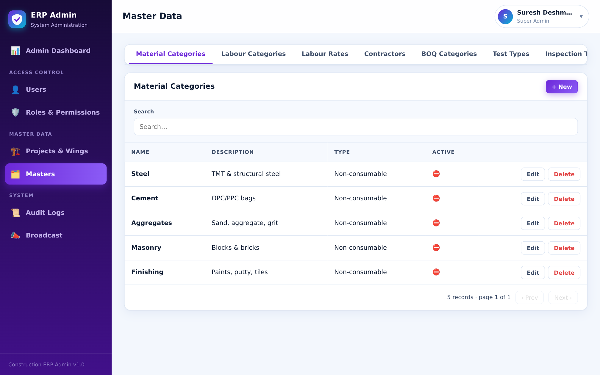
### 5.6 HR & Payroll (admin operations view)

An operational console over the **same** employee data the Web Portal edits — identity, login coverage, leave workflow and payroll settlement at a glance. Access chip shows *Operational* vs *Read-only* based on `hrms.edit`/`hrms.create`.

- **KPI tiles** — Active employees, Linked logins (count of employees with a login), Pending leave, **Payroll due** for the month (pending net).
- **Employee identity & login coverage** — searchable, paginated table: Code, Employee, Designation (+ linked role), Department, Project, **Login** (Linked · name / No login), Status. Note: the list is explicitly shared — "Shared with the Project Tracking HR & Payroll panel".
- **Recent leave workflow** — latest 8 requests with **Approve / Reject** buttons on pending rows (`hrms.approve`).
- **Payroll payment status** — latest 8 payroll rows for a chosen month (Gross, Net, Paid, status) with **Record payment** (same modal as the portal: amount ≤ net, date, reference) and a **Generate payroll** button (bulk, same engine as the portal).

| Action | API | Tables |
|---|---|---|
| Summary | `GET /api/hrms/summary` | `hrms_employees`, `hrms_leave_requests`, `hrms_payroll` |
| Employees | `GET /api/hrms/employees?page=&search=` | `hrms_employees` + links |
| Leave decide | `PUT /api/hrms/leave-requests/:id/decide` | `hrms_leave_requests` |
| Payroll list | `GET /api/hrms/payroll?payroll_month=` | `hrms_payroll` |
| Generate | `POST /api/hrms/payroll/generate-bulk` | `hrms_payroll` (engine of §4.18) |
| Record payment | `PUT /api/hrms/payroll/:id/payment` | `hrms_payroll` |

> The full create/edit/delete of employees, salary structures and leave types is done in the **Web Portal → HR & Payroll** (or from Users → "Create employee record" here); this admin view is for the settlement workflow.

### 5.7 Petty Cash (admin view)

The same ledger as the portal (identical data & API), presented for finance oversight: project filter, type/category filters, summary (cash on hand, spend by category, recent activity), entries table, CSV export. Entry create/edit/delete uses the same `petty_cash.*` permissions.

| Action | API | Tables |
|---|---|---|
| List / summary / export / CRUD | `GET /api/petty-cash` · `GET /api/petty-cash/summary` · `GET /api/petty-cash/export` · `POST|PUT|DELETE /api/petty-cash…` | `petty_cash_entries`, `audit_logs` |

### 5.8 Audit Logs

The complete mutation trail of the platform — every create, update, delete and export by every user.

- **Columns** — When (timestamp), User, Action badge (create green / update blue / delete red / export purple), Module, Record id, IP.
- **Filters** — search (user or record), Module (all 26 audited modules: auth, users, roles, projects, wings, floors, units, progress, milestones, drawings, materials, inventory, purchase_orders, billing, boq, test_reports, inspections, issues, workers, attendance, labour_payments, sales, documents, reports, notifications, system), User (directory select).
- **Row click → detail modal** — full JSON of **old value** and **new value**, plus IP and user-agent.
- **⬇ Export CSV** (`admin.export`).

| Action | API | Tables |
|---|---|---|
| List | `GET /api/admin/audit-logs?page=&module=&userId=&search=` | `audit_logs` (indexed by module/user/time) |
| Export | `GET /api/admin/audit-logs/export` | CSV, audited |

**How entries are created:** every controller mutation calls the shared `audit()` helper *inside the request*, writing user_id, user_name, action, module, record_id, old/new JSON, IP and user-agent. Auditing is fire-and-forget — it can never fail the business operation.

### 5.9 Broadcast

Push an announcement to specific users or the whole organisation.

- **Fields** — Title, Message, **Type** (info / success / warning / error), **Audience**: "All users" (default) or an individual user picker.
- **Send** writes one `notifications` row per target user (title, message, type, module=system). Target users see it in their bell next poll; mobile users on registered devices also receive it via the Expo push relay using their stored push token.
- **Sent count** is shown after each broadcast.

| Action | API | Tables | Side effects |
|---|---|---|---|
| User picker | `GET /api/auth/user-directory` | `users` (active) | — |
| Send | `POST /api/notifications/broadcast` `{title, message, type, userIds?[]}` | `notifications` (one row per user) | Push tokens (`user_push_tokens`) relayed where available |

---

## 6. Mobile App — screen guide (site engineer)

The Expo (React Native) app is the field companion: camera + GPS capture that works **offline** and syncs automatically.

### 6.1 Screens

| Screen | Purpose |
|---|---|
| **Login** | Email + password against the same API (`POST /api/auth/login`); tokens stored in SecureStorage; forgot-password link |
| **Dashboard** | Quick stats for the engineer's projects (open issues, pending inspections, recent progress) + quick actions |
| **Progress List** | Daily reports for the engineer's projects, with sync-state indicators |
| **Progress Capture** | The star screen: project/wing/floor, date, work description, %, labour, weather, remarks, **camera photos (each auto-tagged with GPS + timestamp)**, GPS capture, save — works offline |
| **Progress Detail** | Full report with photos (each showing source + coordinates) |
| **Attendance** | Mark worker attendance for a project/date (same statuses as web: present/absent/half day/leave/overtime + OT hours) |
| **Inspections** / **Inspection Detail** | Checklist inspections with pass/fail/N-A, GPS, photos |
| **Issues** / **Issue Create** / **Issue Detail** | Raise and resolve issues with photos + GPS; comment thread |
| **Notifications** | In-app notification list (polling + Expo push), mark read |
| **Sync Queue** | Every offline item with its state (queued / syncing / error / done), retry buttons |
| **More** | Profile, device push-token registration, logout, app info |

### 6.2 Offline queue (how it works)

```
capture (no network)
   │  client_ref = unique id generated on device
   ▼
AsyncStorage  '@cerp/offline-queue'  (idempotent: same client_ref never enqueued twice)
   │
   │  background auto-sync + manual "Sync now"
   ▼
POST /api/progress/sync   (batch)   or   POST /api/issues / POST /api/attendance
   │
   ├─ 200 created  → item removed from queue
   ├─ duplicate    → server returned the existing row id (client_ref guard) → item removed
   └─ error        → kept in queue, retried with backoff, visible in Sync Queue screen
```

- The web app uses the same `client_ref` guard for its own offline fallback queue.
- Push notifications: the app registers its Expo push token once via `POST /api/notifications/push-token` (stored in `user_push_tokens`) and relays in-app notifications through the standard endpoint.

| Action | API | Tables |
|---|---|---|
| Create progress (online) | `POST /api/progress` (multipart, per-photo GPS + meta) | `daily_progress`, `progress_photos`, `file_uploads` + roll-up |
| Batch sync (offline items) | `POST /api/progress/sync` | as above; per-item `created/duplicate/error` results |
| Attendance | `POST /api/attendance` | `attendance` (server-computed wages) |
| Inspections | `POST /api/inspections` | `inspections`, `inspection_items` |
| Issues | `POST /api/issues` (multipart) | `issues`, photos, notifications |
| Push token | `POST /api/notifications/push-token` | `user_push_tokens` |
| Notifications | `GET /api/notifications` · `PUT /api/notifications/:id/read` | `notifications` |

### 6.2b Marketing site

The public landing page (`marketing/`) is a static React site with no authentication. It describes the ERP's actual capabilities — project structure, daily progress with geo-tagged photos, material lifecycle, BOQ variance, quality, workforce, HR & payroll, petty cash, equipment, sales, notifications, audit — with module names that match the real applications. It is for prospects and is not part of the operational data flow.
---

## 7. End-to-end data flows (complete)

This chapter chains the per-screen flows into the full cross-module journeys. Each flow lists the tables touched in order and the side effects.

### 7.1 Authentication & session lifecycle

```
login(email,pw) ─▶ POST /auth/login
                    ├─ users (bcrypt check, last_login_at)
                    ├─ refresh_tokens (new hashed token)
                    └─ JWT access (id, roles, permissions) + refresh
every request   ─▶ Authorization: Bearer <access>
                    ├─ middleware authenticates (JWT verify)
                    ├─ attachProjectScope (user_projects → project/wing sets)
                    └─ requirePermission(module.action)
token expiry    ─▶ POST /auth/refresh  (old refresh revoked, new issued)
logout/reset PW ─▶ POST /auth/logout | PUT /users/:id/reset-password
                    └─ refresh_tokens.revoked_at = now  (all devices out)
```

| Actor | Path |
|---|---|
| Any user, any app | Login → tokens → scoped, permission-checked requests → transparent refresh → revocation on logout/reset |

### 7.2 User & employee provisioning (identity sync)

Two entry points, one identity:

```
A) Admin Console → Users → New User
   POST /users  ─▶ users (bcrypt) ─▶ user_roles ─▶ user_projects
   [+ createEmployee?] ─▶ hrms_employees (+ user_id back-link)
B) Web Portal → HR & Payroll → Add employee
   POST /hrms/employees  ─▶ hrms_employees
   [+ create_login?] ─▶ users ─▶ user_roles (selected ∪ designation-linked role)
                          └─ hrms_employees.user_id = new user id
```

- **One-to-one link:** a user and an employee can never be double-linked (both UIs block it; the server rejects it).
- **Designation → role mapping:** `hrms_designations.role_id` means "employees with this designation automatically get this login role" — enforced at provisioning, displayed as the *effective designation* on profiles.
- **Delete semantics:** deleting the **employee** keeps the login (unlinked); deleting the **user** keeps the audit history.
- **Audit:** every step writes `audit_logs` rows.

### 7.3 Project setup & progress roll-up

```
Admin/PM creates project ─▶ projects
   adds wing      ─▶ wings            (manager, dates, status)
   adds floors    ─▶ floors           (per wing)
   adds units     ─▶ units            (saleable area, price, status=available)

daily progress saved (anywhere: web, mobile, sync)
   └─▶ recomputeProjectProgress(projectId)   [same DB transaction]
         wing.progress    = AVG(daily_progress.percentage) per wing
         projects.overall = AVG(wing.progress) per project
```

**Tables:** `projects`, `wings`, `floors`, `units`, `daily_progress`.
**Consumers of roll-up:** Dashboard (KPI + 30-day trend + status donut), Project Detail header, Reports (`project-progress`), notifications on delayed milestones.

### 7.4 Daily progress entry — web & mobile (with photos, GPS, offline)

| # | Step | UI | API | Tables written | Side effects |
|---|---|---|---|---|---|
| 1 | Fill report (project→wing→floor, date, %, labour, weather, text) | Portal *New Report* / Mobile *Capture* | — | — | GPS captured (browser / device) |
| 2 | Attach photos (≤8) | file pick / camera | — | — | per-photo GPS + timestamp in `photosMeta` |
| 3 | Save online | both | `POST /api/progress` (multipart, `client_ref`) | `file_uploads`, `progress_photos`, `daily_progress` | progress roll-up; audit |
| 4a | Save offline (mobile) | queue | (none) | device storage `@cerp/offline-queue` | item visible in Sync Queue |
| 4b | Auto-sync | background | `POST /api/progress/sync` | as step 3, per item | duplicate guard by `client_ref`; per-item result |
| 5 | View / deep-link | bell or list | `GET /api/files/:id` per photo | `file_uploads` read | photo shows source + coords |
| 6 | Dashboard reflects it | — | `GET /api/dashboard/overview` | — | trend + recent-updates lists |

### 7.5 Material procurement cycle (requirement → PO → GRN → stock)

| # | Step | Actor | API | Tables | Side effects |
|---|---|---|---|---|---|
| 1 | Engineer raises requirement | Site | `POST /materials/requirements` | `material_requirements` (REQ-…) | — |
| 2 | Store approves / rejects | Store Mgr | `PUT /materials/requirements/:id/status` | `material_requirements` | notification `po_approval` to requester |
| 3 | Store creates PO (items, rates, tax, discount) | Store Mgr | `POST /materials/purchase-orders` | `purchase_orders` (auto totals) + `purchase_order_items` | status draft |
| 4 | Submit → Approve → Mark sent | Store Mgr / PM | `PUT /materials/purchase-orders/:id/status` | `purchase_orders` (+approved_by/at) | approval notifies creator |
| 5 | Delivery received — GRN | Store | `POST /materials/receipts` | `material_receipts` + `material_receipt_items` (accepted = received − damaged) | **`stock_transactions` (+ accepted)**; PO item `received_qty`; PO → partially_received/received; notification `material_received` |
| 6 | Stock position updates live | Store/PM | `GET /materials/stock` | ledger aggregate | **LOW STOCK badge** when ≤ min level (dashboard KPI + `material_shortage` event) |
| 7 | Optional returns | Store | `POST /materials/returns` → `PUT …/approve` | `material_returns` + ledger (+qty) | stock back up |
| 8 | Accounts settles vendor | Accountant | `POST /billing/cost-entries` (type consumable, supplier, bill no) | `cost_entries` | vendor-due KPI, budget-vs-actual |

### 7.6 Material consumption on site

```
engineer ─▶ POST /materials/consumption {project, wing, material, qty, date, location}
             ├─ read current stock (Σ stock_transactions for project+material)
             ├─ reject if qty > stock
             └─ insert material_consumption + stock_transactions (−qty)
                  └─ if stock now ≤ min level → low-stock notification
```

**Tables:** `material_consumption`, `stock_transactions`. **Feeds:** Stock tab ledger, Material Consumption report, project cost (when mirrored as billing entries), dashboard.

### 7.7 Workforce wage cycle (worker → attendance → payment)

| # | Step | UI | API | Tables | Computation |
|---|---|---|---|---|---|
| 1 | Register worker (category, contractor, wage, OT rate) | Workers tab | `POST /workers` | `workers` | — |
| 2 | Mark attendance per day (status + OT hours) | Attendance tab / Mobile | `POST /attendance` (batch upsert) | `attendance` | `daily_amount` = wage × status factor (1, ½, 0); `overtime_amount` = OT hrs × OT rate — **server-side** |
| 3 | Summary & payroll preview | badges | `GET /attendance/summary` | aggregate | day total |
| 4 | Generate payment for a period | Labour Payments | `POST /labour-payments` | `labour_payments` | gross = Σ(daily+OT) over period; net = gross − deductions |
| 5 | Settle | Mark paid | `PUT /labour-payments/:id` | `labour_payments` | status paid/partial; payment date + mode |
| 6 | Monthly wage report | Reports / API | `GET /attendance/monthly-report` | aggregate | days, OT, gross, paid vs pending per worker |

**Feeds:** Dashboard "Pending Labour Payment" KPI, `labour-payments` report.

### 7.8 HR payroll cycle (structure → leave → bulk payroll → payment)

```
1. HR sets salary structure ─▶ hrms_salary_structures (basic/HRA/DA/…, PF, ESIC, PT, effective_from)
2. Employee raises leave   ─▶ hrms_leave_requests (total_days computed)
3. Manager decides         ─▶ PUT …/decide (approved/rejected, decided_by)
4. End of month: Generate  ─▶ POST /hrms/payroll/generate-bulk {payroll_month}
     per active employee:
       structure  = latest active with effective_from ≤ end of month
       lop        = approved days of UNPAID leave types in month
       paid       = working_days − lop ; ratio = paid / working_days
       gross      = (basic+HRA+DA+special+other) × ratio
       deduct     = min(gross, (PF-ee + ESIC-ee) × ratio + PT)
       net        = gross − deduct
     ─▶ hrms_payroll (payment_status = pending)      [skips reported in response]
5. Accounts records payment ─▶ PUT /hrms/payroll/:id/payment
     status: 0→pending | <net→partial | ≥net→paid    (paid months are locked from re-generation)
```

**Tables:** `hrms_salary_structures`, `hrms_leave_requests`, `hrms_leave_types`, `hrms_payroll`. **Feeds:** HRMS summary tiles, payroll KPIs, admin payroll status view, employee detail modal.

### 7.9 Unit sales & collections cycle

```
units.status = available  (created under project structure)
   │
   │  sales exec: New Sale (unit only listed if available)
   ▼
POST /sales ─▶ sales (amount, GST, received, pending)  +  units.status → booked|sold
   │
   │  customer pays (staged)
   ▼
POST /sales/:id/payments ─▶ sales_payments  +  sales.amount_received/pending/payment_status
   │                                   pending>0 ─▶ notification sales_payment_due
   ▼
KPIs: units sold · value · collected · pending      Reports: sales · pending-collections
deleting a sale returns the unit to available
```

### 7.10 Equipment operation & hire billing cycle

```
1. register equipment ─▶ equipment (type, ownership, rates, project, status)
2. daily log          ─▶ POST /equipment/logs
      equipment_logs (+hours, fuel, status_after)
      equipment.status = status_after            (fleet board always current)
3. month end          ─▶ POST /equipment/billing/generate {billing_month}
      hours = Σ running_hours of the month
      amount = hours × hourly_rate  ─▶ equipment_billing (pending)
4. settlement         ─▶ PUT /equipment/billing/:id  (paid_amount, status)
```

**Feeds:** equipment summary tiles (fleet by status, month hours + fuel), billing entries in finance, project cost reports.

### 7.11 Quality assurance flow

```
Material test:   lab result ─▶ POST /test-reports (file, values, result)
                 result=fail ─▶ notification test_failed
                 submitted   ─▶ PUT /test-reports/:id/status (approve|reject)

Inspection:      POST /inspections {type, items[], GPS}
                 items ─▶ inspection_items (pass/fail/N-A)
                 any fail ─▶ status failed + notification inspection_failed
                 passed/failed/reinspection_required ─▶ PUT … (close)
```

**Tables:** `test_types`, `test_reports`, `file_uploads`, `inspection_types`, `inspections`, `inspection_items`.

### 7.12 Issue lifecycle & notifications

```
raise (ISS-####, photos, GPS, assignee, due)
   │  issue_created → watchers ; issue_assigned → assignee
   ▼
open → assigned → in_progress → resolved → closed   (reopen allowed)
   │  issue_updated → affected users
   │  due date passed & unresolved → issue_overdue (red in list)
   ▼
comment thread (issue_comments) · dashboard open-issues KPI · issues report
```

### 7.13 Drawing revision control

```
upload drawing (R0) ─▶ drawings + drawing_revisions + file_uploads
   │  notification drawing_revision → approvers
   ▼
add revision (R1, R2…) ─▶ pending
   │
   ├─ approve ─▶ drawing.approval_status = approved ; latest revision = current file
   └─ reject  ─▶ drawing.approval_status = rejected
download/preview always via authenticated GET /files/:id
```

### 7.14 Audit trail & broadcasts (system-wide)

- **Audit:** every mutation in every module → `audit_logs` (user, action, module, record, old/new JSON, IP, agent) → Admin → Audit Logs (filter, inspect, export). Deletes of users/records keep their history.
- **Broadcast:** Admin → Broadcast → `POST /api/notifications/broadcast` → one `notifications` row per target (+ Expo push relay via `user_push_tokens`) → bells in both web apps and mobile list.
- **Notification events** are all gated by `notification_settings.enabled` (Masters → Notification Events).
---

## 8. Data dictionary — all 65 database tables

Single MySQL schema (`backend/database/schema.sql`), 65 tables, FKs and indexes included. Grouped by domain.

### 8.1 Identity & access (9)

| Table | Purpose |
|---|---|
| `users` | Login accounts: email (unique), bcrypt password hash, name, phone, employee_code, status, last_login_at |
| `roles` | Role catalogue: name, code, is_system, is_active |
| `permissions` | Permission catalogue: code `module.action`, module, action |
| `role_permissions` | Role ↔ permission join |
| `user_roles` | User ↔ role join |
| `user_projects` | Project/wing scoping: user, project_id, wing_id (0 = all wings) |
| `refresh_tokens` | Rotating refresh tokens: user, sha256 token hash, device info, expires_at, revoked_at |
| `user_push_tokens` | Expo push tokens per user (mobile) |
| `password_reset_tokens` | Single-use, time-limited reset tokens |

### 8.2 Project structure & progress (10)

| Table | Purpose |
|---|---|
| `projects` | Project master: code, client, manager, budget, dates, status, **overall_progress** (computed) |
| `wings` | Wings/blocks: code, manager, dates, status, **progress** (computed) |
| `floors` | Floors per wing: sequence, status, progress |
| `units` | Saleable units: number, type, saleable area, price, status (available/booked/sold) |
| `milestones` | Schedule events: start/target/completion, percentage, responsible, status |
| `daily_progress` | Daily site reports: description, %, labour, weather, GPS, **client_ref** (dedupe) |
| `progress_photos` | Photos per report: file ref, per-photo GPS, captured_at, source, uploaded_by |
| `file_uploads` | Uploaded files on disk: original name, path, mime, size, owner |
| `drawings` | Drawing master: number, category, **approval_status**, latest revision |
| `drawing_revisions` | Revision history: rev no, date, status (pending/approved/rejected), file ref |

### 8.3 Materials & inventory (11)

| Table | Purpose |
|---|---|
| `material_categories` | Categories with consumable flag |
| `materials` | Material master: code, unit, **min_stock_level** (alert threshold) |
| `suppliers` | Vendor master: contact, GST, address |
| `material_requirements` | Requirements: qty, needed-by, status (pending→approved/rejected→po_created→fulfilled) |
| `purchase_orders` | PO header: supplier, dates, **auto totals** (subtotal/tax/discount/grand), status, approved_by |
| `purchase_order_items` | PO lines: material, qty, unit, rate, tax, amount, running received_qty |
| `material_receipts` | GRN header: PO ref, challan, date |
| `material_receipt_items` | GRN lines: received, damaged, **accepted** qty |
| `material_consumption` | Consumption records: qty, location, date |
| `material_returns` | Returns: qty, status (pending→approved) |
| `stock_transactions` | **The ledger** — every +/− with reference module/id; all stock positions are computed from here |

### 8.4 Finance (6)

| Table | Purpose |
|---|---|
| `cost_entries` | Vendor cost/billing entries: type, category, tax, paid, **payment_status** |
| `sales` | Unit sales: customer, amount, GST, received, pending, payment_status |
| `sales_payments` | Staged collections: amount, date, mode, reference |
| `petty_cash_entries` | Site cash: topup/expense/replenish, category, paid-to |
| `labour_payments` | Worker wage settlements: period, days, OT, gross, deductions, net, paid |
| `equipment_billing` | Monthly hire bills: hours, rate, total, payment status |

### 8.5 Workforce (5)

| Table | Purpose |
|---|---|
| `contractors` | Contractor companies |
| `worker_categories` | Labour categories with base daily rate |
| `labour_rates` | Date-effective rate cards per category/contractor |
| `workers` | Worker master: code, category, contractor, **daily_wage, overtime_rate**, project/wing |
| `attendance` | Daily marks: status, OT hours, **computed daily_amount / overtime_amount**, shift, marked_by |
| `labour_rates`/`labour_payments` | (see Finance for payments) |

### 8.6 BOQ (3)

| Table | Purpose |
|---|---|
| `boq_categories` | BOQ item categories |
| `boq` | BOQ header: tax %, discount, status, totals |
| `boq_items` | Items: est/actual qty × rate, variance |

### 8.7 Quality & issues (8)

| Table | Purpose |
|---|---|
| `test_types` | Lab test catalogue |
| `test_reports` | Results: lab, standard, result values, result_status, approval status, file |
| `inspection_types` | Inspection catalogue with **checklist template** |
| `inspections` | Inspection reports: date, inspector, GPS, status |
| `inspection_items` | Checklist lines: item, result (pass/fail/N-A) |
| `issue_categories` | Issue categories |
| `issues` | Issues: priority, assignee, due, GPS, status workflow, photos |
| `issue_comments` | Discussion thread |

### 8.8 Documents, equipment & system (6)

| Table | Purpose |
|---|---|
| `project_documents` | Document vault: category, version, **expiry_date** |
| `notifications` | In-app notifications: user, title, message, type, module, record_id, is_read |
| `notification_settings` | Per-event on/off switches |
| `audit_logs` | Full mutation trail: user, action, module, record, old/new JSON, IP, agent |
| `equipment` | Fleet master: type, ownership, rates, status, project |
| `equipment_logs` | Daily hour/fuel logs with status_after |

### 8.9 HRMS (7)

| Table | Purpose |
|---|---|
| `hrms_departments` | Department master |
| `hrms_designations` | Designation master with **role mapping** (role_id) |
| `hrms_employees` | Shared employee directory: all profile fields, project/wing, **user_id** (login link) |
| `hrms_leave_types` | Leave catalogue: code, annual quota, paid flag |
| `hrms_leave_requests` | Requests: dates, computed days, status, decision fields |
| `hrms_salary_structures` | Salary components per employee with effective_from |
| `hrms_payroll` | Monthly payroll: working/paid/Lop days, gross, deductions, net, payment fields |

**Total: 65 tables.** Stock positions, progress percentages, PO totals, payroll figures and payment statuses are all *computed* values — the stored facts are the transactions and the source rows.

---

## 9. Status & workflow reference

| Entity | States | Notes |
|---|---|---|
| Project | planning · in_progress · on_hold · completed · cancelled | overall_progress auto-computed |
| Wing | same as project | progress auto-computed |
| Floor | pending · in_progress · completed · on_hold | pending displays as "planning" |
| Unit | available · booked · sold | flipped by sales; delete blocked when sold |
| Milestone | pending · in_progress · completed · delayed | 100 % auto-completes |
| Requirement | pending · approved · rejected · po_created · fulfilled | approve/reject gated by `materials.approve` |
| Purchase order | draft · pending_approval · approved · sent · partially_received · received · cancelled | GRN moves it forward automatically |
| GRN item | received / damaged / accepted | accepted = received − damaged |
| Material return | pending · approved | approval adds stock back |
| Cost entry (payment) | unpaid · partial · paid | derived from paid vs total |
| Labour payment | pending · partial · paid | generated from attendance period |
| Sale (payment) | pending · partially_paid · paid · overdue | staged payments |
| Issue | open · assigned · in_progress · resolved · closed | reopen → in_progress; overdue flagged |
| Inspection | pending · passed · failed · reinspection_required · closed | any failed item → failed |
| Test report | status: draft → submitted → approved/rejected; result: pending · pass · fail · inconclusive | fail raises notification |
| Drawing revision | pending · approved · rejected | approval sets drawing approval_status |
| Equipment | available · deployed · maintenance · breakdown · idle | flips to log's status_after |
| Equipment billing | pending · partial · paid | monthly, hours × hourly rate |
| Employee | active · on_leave · resigned · terminated | login link optional |
| Leave request | pending · approved · rejected | unpaid approved leave feeds payroll |
| Payroll record | pending · partial · paid | paid months locked from re-generation |
| User | active · inactive | reset password revokes sessions |

---

## 10. Tips, FAQ & troubleshooting

**General**

- *I don't see a menu item.* Your roles don't include the module's `view` permission, or (for scoped modules) you have no matching project assignment. Ask your admin to check Roles → Permissions and Users → Project Access.
- *I can open a screen but a button is missing.* That button needs an extra action (e.g. `approve`, `export`) — same fix.
- *Every screen still blocks me on the server (403).* The API enforces permissions independently of the UI; the message names the exact permission code.

**Progress & photos**

- *Project % seems "wrong".* It is not typed: wing % = average of that wing's daily progress entries; project % = average of wing %. Delete/correct the underlying reports to change it.
- *Duplicate progress report after mobile sync?* Impossible by design — `client_ref` dedupe; the sync returns `duplicate` with the existing id.
- *Photos show "no GPS".* Geolocation was denied or unavailable at capture; the photo still saves.

**Materials**

- *Consumption rejected with "insufficient stock".* The ledger has less than the quantity; receive a GRN first or reduce the quantity.
- *Where is my damaged quantity?* In the GRN detail (per item) and the Stock tab's Damaged column — damaged stock never enters available stock.
- *LOW STOCK badge.* Stock fell to or below the material's Min stock level (Masters/Materials field). Raise a requirement.

**Workforce & HR**

- *Attendance day-pay looks wrong.* Check the worker's daily wage and OT rate on the Workers tab; half day pays 50 %, absent/leave pay 0.
- *Payroll month won't regenerate.* Any month with a recorded payment is locked — correct the payment record instead.
- *Employee missing from payroll generation.* Must be active (status active) and have a salary structure effective in that month; skips are listed in the toast.

**Sales**

- *Unit not in the New Sale list.* It is already booked/sold (only `available` units are offered).
- *Collections show pending.* Use the row's **+ Payment** to record staged payments; status updates automatically.

**Security & administration**

- *How do I force a user out everywhere?* Users → Reset PW (or the user changes their password) — all refresh tokens are revoked.
- *Who did what to record X?* Audit Logs → filter by module/record; the detail shows full old/new JSON, IP and user-agent.
- *Can I silence a notification type?* Masters → Notification Events → toggle off.

**Deployment reminders**

- Change all seed passwords; set strong JWT secrets in `backend/.env`; run `npm run smoke` after `db:setup` to verify the 17-point API check; see `docs/INSTALLATION.md` and `docs/DEPLOYMENT.md` for production hardening.
